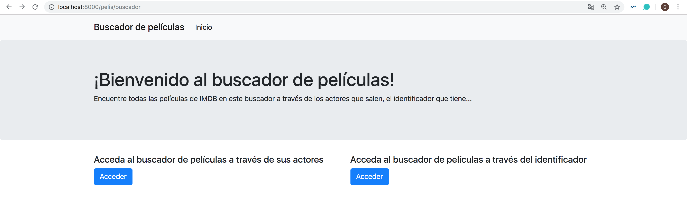

# Sistemas Software Basados en Web

#### Gema Correa Fernández

Repositorio para la asignatura de Sistemas Software Basados en Web del Máster de Ingeniería Informática de la UGR del curso 2018/2019.

**Tareas realizadas en la asignatura:**

- [Tarea 0: Entorno de desarrollo con docker-compose](https://github.com/Gecofer/MII_SSBW_1819/tree/master/Tarea%200): se crea el entorno de desarollo con `docker-compose`, con el cual vamos a trabajar durante toda la asignatura.

- [Tarea 1: Ejercicios de Python](https://github.com/Gecofer/MII_SSBW_1819/tree/master/Tarea%201)
  - Ejercicio (http://localhost:8000/ejercicios/hola/andrea): muestra 'hola' y el nombre asignado por nosotros en la URL, de modo que se produce 'hola andrea'.

- [Tarea 2: Ejercicios de Python](https://github.com/Gecofer/MII_SSBW_1819/tree/master/Tarea%202)
  - Ejercicio 1 (http://localhost:8000/ejercicios/tarea2/ejercicio1/a-aaa-aa-aaaa-a): dada una lista de string, devuelve la cuenta del número de string.
  - Ejercicio 2 (http://localhost:8000/ejercicios/tarea2/ejercicio2/a-aaa-aa-aaaa-a-a-a-aaa): dada una lista, devuelve la lista sin elementos repetidos.
  - Ejercicio 3 (http://localhost:8000/ejercicios/tarea2/ejercicio3/spring): dada una cadena, devuelve una cadena hecha de los 2 primeros y los 2 últimos caracteres de la cadena original, de modo que 'spring' produce 'spng'.
  - Ejercicio 4 (http://localhost:8000/ejercicios/tarea2/ejercicio4/sprin): dada una cadena, si su longitud es de al menos 3, se añade 'ing' a su extremo, pero si termina en 'ing", se añade 'ly' en su lugar.
  - Ejercicio 5 (http://localhost:8000/ejercicios/tarea2/ejercicio5): dado un texto, obtener su diccionario mímico y mostrar un texto aleatorio que imita al original.

- [Tarea 3: Expresiones Regulares](https://github.com/Gecofer/MII_SSBW_1819/tree/master/Tarea%203)
  - Ejercicio (http://localhost:8000/ejercicios/tarea3/titulares): extraer mediante el uso de expresiones regulares, los titulares y las imágenes de un periódico.

- [Tarea 4: Base de Datos MongoDB](https://github.com/Gecofer/MII_SSBW_1819/tree/master/Tarea%204): se ha añadido un servicio de base de datos con MongoDB y para consultarla se ha usado mongoengine a partir de la clase Pelis.
  - Consultas realizadas con `pymongo`:
    - Ejercicio 1 (http://localhost:8000/ejercicios/tarea4/pymongo1): mostrar las diez primeras películas de la base de datos.
    - Ejercicio 2 (http://localhost:8000/ejercicios/tarea4/pymongo2/2016): mostrar las primeras películas de la base de datos a partir de la fecha introducida, para ello se debe de introducir en la URL el año que se desea consultar.
    - Ejercicio 3 (http://localhost:8000/ejercicios/tarea4/pymongo3/Harrison%20Ford): mostrar las primeras películas de la base de datos a partir del actor de la película, para ello se debe de introducir en la URL el actor que se desea consultar.
  - Consultas realizadas con `mongoengine`:  
    - Ejercicio (http://localhost:8000/pelis/tarea4/mongoengine1/Harrison%20Ford): mostrar las primeras películas de la base de datos a partir del actor de la película, para ello se debe de introducir en la URL el actor que se desea consultar.

**Para la tarea 5, 6 y 7 se ha creado una página principal para acceder a los dos buscadores siguientes:**

- [Tarea 5: CSS Frameworks y formularios](https://github.com/Gecofer/MII_SSBW_1819/tree/master/Tarea%205): se crea un formulario con `mongoengine`, en donde se introduce el actor a buscar, y dándole a "Buscar" (http://localhost:8000/pelis/formulario), dicha página nos redirige a (http://localhost:8000/pelis/pelis_que_sale/Harrison%20Ford).

- [Tarea 6: CSS](https://github.com/Gecofer/MII_SSBW_1819/tree/master/Tarea%206): se crea un formulario para introducir el ID de la película (http://localhost:8000/pelis/formulario_id) y dándole a "Buscar" e introduciendo el ID correspondiente _5b107bec1d2952d0da9046e1_, dicha página nos redirige a http://localhost:8000/pelis/informacion_pelicula/5b107bec1d2952d0da9046e1, página hecha con CSS que contiene información acerca de la película.

- [Tarea 7: CRUD](https://github.com/Gecofer/MII_SSBW_1819/tree/master/Tarea%207): se añade la funcionalidad de crear, eliminar y modificar películas de la base de datos, para ello es necesario acceder a http://localhost:8000/pelis/crud, en donde se nos permite realizar cada unas de las funciones que acabamos de comentar.

- [Tarea 8: Autentificación, Autorización, y Registro de eventos](https://github.com/Gecofer/MII_SSBW_1819/tree/master/Tarea%208): se ha añadido _logging_ a la aplicación, para así registrar los logs de algunas funciones y saber el estado del sistema. Por otro lado, para conectar nuestra aplicación a un servidor web como **nginx**, ha sido necesario hacer uso de la gestión _https_, lo que determina que ahora podamos acceder tanto a http://localhost:8000/pelis/buscador como a https://localhost/pelis/buscador. Por último, se ha hecho una autentificación de usuarios, en donde según que determinadas acciones se realicen, será necesario autenticarse.

- [Tarea 9: Autorización CRUD](https://github.com/Gecofer/MII_SSBW_1819/tree/master/Tarea%209): la incorporación de autorización al CRUD se ha realizado junto con la [tarea 8](https://github.com/Gecofer/MII_SSBW_1819/tree/master/Tarea%208).

- [Tarea 10: JavaScript, jQuery](https://github.com/Gecofer/MII_SSBW_1819/tree/master/Tarea%2010): para la realización de esta tarea se ha añadido un botón para poner la pantalla en modo 'nocturno' cambiando los colores del CSS de las vistas hechas hasta ahora.

- [Tarea 11: AJAX, ES6 fetch](https://github.com/Gecofer/MII_SSBW_1819/tree/master/Tarea%2011)

- [Tarea 12: API REST](https://github.com/Gecofer/MII_SSBW_1819/tree/master/Tarea%2012): se ha añadido un API REST a la aplicación y las funciones necesarias para responder a las peticiones GET, PUT, POST y DELETE, para ello se han creado dos funciones. En donde `api_pelis(request)` es una función para la API que lista todas las películas con GET y permite añadir con POST (http://localhost:8000/pelis/api_pelis) y `api_peli(request, id)`: función para la API que permite listar todas las películas con GET, modificarlas con PUT y/o borrarlas con DELETE (http://localhost:8000/pelis/api_peli/5b107bec1d2952d0da90471f). Pero como manejar así POST, PUT y DELETE es más complicado, se hace uso de DJANGO REST Framework, en donde se hace el mismo funcionamiento explicado, solo que haciendo uso de una interfaz gráfica:
    - http://localhost:8000/pelis/apipelis/: en esta API podemos hacer GET y POST.
    - http://localhost:8000/pelis/apipelis/5b107bec1d2952d0da90471f/: en esta API podemos hacer GET, DELETE y PUT.

- [Tarea 13: Single Page Application con React](https://github.com/Gecofer/MII_SSBW_1819/tree/master/Tarea%2013): se crea un _front-end_ con React para la API de la Tarea 12 (http://localhost:8000/pelis/api_pelis), para acceder a dicho contenido debemos hacer `npm start` en la carpeta de **frontend** lo que nos abrirá la siguiente página http://localhost:3000/. Esta aplicación con React hace un GET de las películas a la API y las muestra.

- [Tarea 14: Producción](https://github.com/Gecofer/MII_SSBW_1819/tree/master/Tarea%2014)
