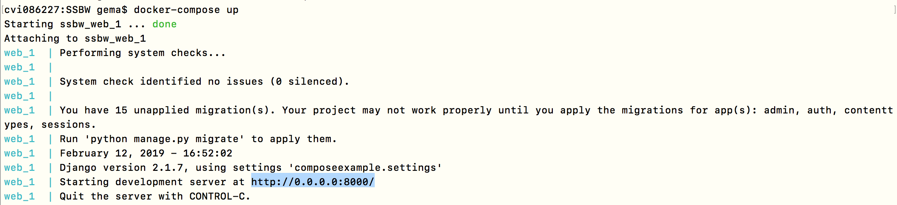
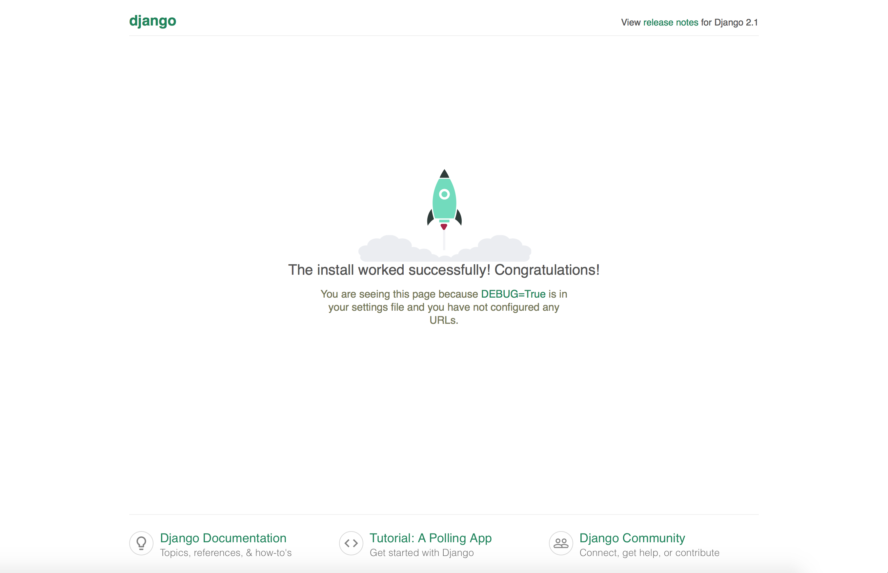

## Tarea 0

### Entorno de desarrollo con docker-compose

#### 1. Instalar Docker Compose

Usaremos [docker-compose](https://docs.docker.com/compose/) como entorno de desarrollo durante toda la asignatura. Es por ello, que vamos a instalarlo, empezamos [instalando docker-compose](https://docs.docker.com/compose/install/). También está en el apt-get de ubuntu, pero [puede no estar en la última versión](https://linuxize.com/post/how-to-install-and-use-docker-compose-on-ubuntu-18-04/).

Para instalarlo, seguimos el [tutorial oficial](https://docs.docker.com/compose/install/), en donde se nos dice que **Docker Desktop** para Mac y **Docker Toolbox** ya incluyen Compose junto con otras aplicaciones Docker, por lo que los usuarios de Mac no necesitamos instalar Compose por separado (_instalación realizada en la asignatura de Cloud Computing_).

~~~
# Lo podemos instalar para asegurarnos
$ pip3 install docker-compose

# Versión de Docker
$ docker -v
Docker version 18.09.1, build 4c52b90

# Versión de Docker Compose
$ docker-compose -v
docker-compose version 1.23.2, build 1110ad0
~~~

#### 2. Docker Compose y Django

Seguiremos los pasos de [Quickstart: Compose and Django](https://docs.docker.com/compose/django/).

1. Creamos un directorio para la asignatura y nos situamos en él:

	~~~
	$ mkdir SSBW
	$ cd SSBW
	~~~

2. Creamos un archivo **Dockerfile** y añadimos el siguiente contenido:

	~~~
	FROM python:3
	ENV PYTHONUNBUFFERED 1
	RUN mkdir /code
	WORKDIR /code
	COPY requirements.txt /code/
	RUN pip install -r requirements.txt
	COPY . /code/
	~~~

	Este archivo Docker instala una imagen de Python 3. La imagen se modifica añadiendo un nuevo directorio de código e instalando los requisitos de Python definidos en el archivo requirements.txt.

	- Diferencias entre Python 2 y Python 3:
		- Python 2.7 no tiene unicode y 3 si,
		- print (sys.platform): espacios de nombre sys, variable platform

3. Nos creamos el fichero **requirements.txt**, el cual contiene las librerías de Python que se van a instalar.

	~~~
	Django>=2.0,<3.0
	~~~

4. Creamos un archivo llamado **docker-compos.yml** en el directorio del proyecto. Este archivo describe los servicios que hay que la aplicación. En este ejemplo, estos servicios son un servidor web y una base de datos. El archivo compose también describe qué imágenes Docker utilizan estos servicios, cómo se enlazan entre sí y los volúmenes que pueden necesitar montados dentro de los contenedores. Finalmente, el archivo _docker-compose.yml_ describe qué puertos exponen estos servicios.

	~~~
	version: '3'

	services:
	  web:
	    build: .
	    command: python manage.py runserver 0.0.0.0:8000
	    volumes:
	      - .:/code
	    ports:
	      - "8000:8000"
	~~~

	`build: .`: el punto es para decir donde está el Dockerfile

	`volumes: - .:/code`: el punto es para decir donde está el Dockerfile, y lo monta en /code (ahí dentro).

	`ports: - "8000:8000"`: el puerto que se abre

##### 2.1. Crear proyecto Django

1. Para crear un proyecto Django, hacer: `docker-compose run web django-admin startproject composeexample .`

	~~~
	$ ls -la
	total 48
	drwxr-xr-x   8 gema  staff   272 12 feb 17:50 .
	drwx------+ 14 gema  staff   476 12 feb 17:06 ..
	-rw-r--r--@  1 gema  staff  6148 12 feb 17:50 .DS_Store
	-rw-r--r--   1 gema  staff   146 12 feb 17:19 Dockerfile
	drwxr-xr-x   6 gema  staff   204 12 feb 17:50 composeexample
	-rw-r--r--   1 gema  staff   157 12 feb 17:31 docker-compose.yml
	-rwxr-xr-x   1 gema  staff   546 12 feb 17:50 manage.py
	-rw-r--r--   1 gema  staff    17 12 feb 17:32 requirements.txt
	~~~

2. Cambiamos los permisos, para cambiar el propietario de root a gema: `sudo chown -R gema:gema .`

#### 3. Ejecutar el proyecto

1. Con `docker-compose build` creamos las imágenes.

	~~~~
	Building web
	Step 1/7 : FROM python:3
	 ---> 338b34a7555c
	Step 2/7 : ENV PYTHONUNBUFFERED 1
	 ---> Using cache
	 ---> 401d99c85324
	Step 3/7 : RUN mkdir /code
	 ---> Using cache
	 ---> 5e65159c2995
	Step 4/7 : WORKDIR /code
	 ---> Using cache
	 ---> e214b7fdbc47
	Step 5/7 : COPY requirements.txt /code/
	 ---> 6a19955d3916
	Step 6/7 : RUN pip install -r requirements.txt
	 ---> Running in 1a72a6db0457
	Collecting Django<3.0,>=2.0 (from -r requirements.txt (line 1))
	  Downloading https://files.pythonhosted.org/packages/c7/87/fbd666c4f87591ae25b7bb374298e8629816e87193c4099d3608ef11fab9/Django-2.1.7-py3-none-any.whl (7.3MB)
	Collecting pytz (from Django<3.0,>=2.0->-r requirements.txt (line 1))
	  Downloading https://files.pythonhosted.org/packages/61/28/1d3920e4d1d50b19bc5d24398a7cd85cc7b9a75a490570d5a30c57622d34/pytz-2018.9-py2.py3-none-any.whl (510kB)
	Installing collected packages: pytz, Django
	Successfully installed Django-2.1.7 pytz-2018.9
	You are using pip version 19.0.1, however version 19.0.2 is available.
	You should consider upgrading via the 'pip install --upgrade pip' command.
	Removing intermediate container 1a72a6db0457
	 ---> 737383c207c7
	Step 7/7 : COPY . /code/
	 ---> 1922f3e6538e
	Successfully built 1922f3e6538e
	Successfully tagged ssbw_web:latest
	cvi086227:SSBW gema$ docker images
	REPOSITORY          TAG                 IMAGE ID            CREATED             SIZE
	ssbw_web            latest              1922f3e6538e        8 minutes ago       964MB
	<none>              <none>              7aa8c1e11649        16 minutes ago      932MB
	python              3                   338b34a7555c        6 days ago          927MB
	cvi086227:SSBW gema$ docker-compose up
	Recreating ssbw_web_1 ... done
	Attaching to ssbw_web_1
	.....
	~~~~

2. Con `docker images` vemos la imagen.

3. Con `docker-compose up` podemos compropbar que funciona iniciando el contenedor y que pondrá el servidor de desarrollo en http://localhost:8000 y se para el contenedor con CTRCL+C. Esto es para lanzar la configuración, es más rapido así que hacerlo a mano.

	~~~
	Starting ssbw_web_1 ... done
	Attaching to ssbw_web_1
	web_1  | Performing system checks...
	web_1  |
	web_1  | System check identified no issues (0 silenced).
	web_1  |
	web_1  | You have 15 unapplied migration(s). Your project may not work properly until you apply the migrations for app(s): admin, auth, contenttypes, sessions.
	web_1  | Run 'python manage.py migrate' to apply them.
	web_1  | February 12, 2019 - 16:52:02
	web_1  | Django version 2.1.7, using settings 'composeexample.settings'
	web_1  | Starting development server at http://0.0.0.0:8000/
	web_1  | Quit the server with CONTROL-C.
	web_1  | Invalid HTTP_HOST header: '0.0.0.0:8000'. You may need to add '0.0.0.0' to ALLOWED_HOSTS.
	web_1  | Bad Request: /
	web_1  | [12/Feb/2019 16:53:05] "GET / HTTP/1.1" 400 55903
	web_1  | Invalid HTTP_HOST header: '0.0.0.0:8000'. You may need to add '0.0.0.0' to ALLOWED_HOSTS.
	web_1  | Bad Request: /favicon.ico
	web_1  | [12/Feb/2019 16:53:05] "GET /favicon.ico HTTP/1.1" 400 55965
	web_1  | [12/Feb/2019 16:53:20] "GET / HTTP/1.1" 200 16348
	web_1  | [12/Feb/2019 16:53:20] "GET /static/admin/css/fonts.css HTTP/1.1" 200 423
	web_1  | [12/Feb/2019 16:53:20] "GET /static/admin/fonts/Roboto-Regular-webfont.woff HTTP/1.1" 200 80304
	web_1  | [12/Feb/2019 16:53:20] "GET /static/admin/fonts/Roboto-Light-webfont.woff HTTP/1.1" 200 81348
	web_1  | [12/Feb/2019 16:53:20] "GET /static/admin/fonts/Roboto-Bold-webfont.woff HTTP/1.1" 200 82564
	web_1  | Not Found: /favicon.ico
	web_1  | [12/Feb/2019 16:53:20] "GET /favicon.ico HTTP/1.1" 404 1980
	web_1  | Not Found: /apple-touch-icon-precomposed.png
	web_1  | [12/Feb/2019 16:53:20] "GET /apple-touch-icon-precomposed.png HTTP/1.1" 404 2043
	web_1  | Not Found: /apple-touch-icon.png
	web_1  | [12/Feb/2019 16:53:20] "GET /apple-touch-icon.png HTTP/1.1" 404 2007
	^CGracefully stopping... (press Ctrl+C again to force)
	Stopping ssbw_web_1 ... done
	~~~

	

	

4. Para ver que se ha creado `docker ps`.

Además, podemos ahora usar el python del contenedor:

~~~
# Abrir el ejecutable de python en consola
$ docker-compose run web python

# Ahora en otro terminal para el contenedor web y el intérprete python
$ docker-compose run web python hola_mundo.py
Hola mundo
~~~

----

**Para la próxima clase `ipython`**
