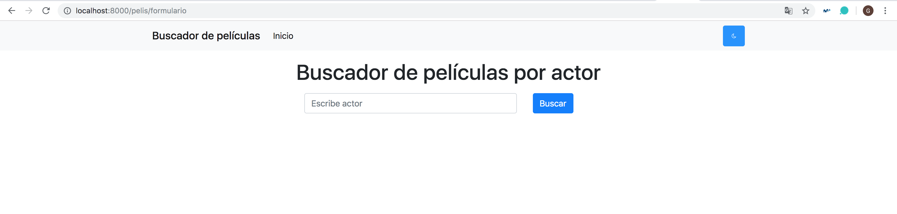

## Tarea 10: JavaScript, jQuery

Para la realización de esta tarea se ha añadido un botón para poner la pantalla en modo 'nocturno' cambiando los colores del CSS. Por lo que se ha hecho uso del [tutorial](https://codepen.io/HarlemSquirrel/pen/NdMebZ) para la incorporación de dicha funcionalidad. Se ha añadido el botón para todas las vistas que lo permiten, a continuación se puede ver un breve ejemplo:

### Página buscador inicial

### Página para consultar las películas protagonizadas por dichos actores

### Página para el CRUD

