## Tarea 12: API REST

En esta tarea vamos hacer un API REST, que solo se va a conectar a la BD con el servidor. Para ello se quiere crear un API REST a la aplicación y las funciones necesarias para responder a las peticiones GET, PUT, POST y DELETE recibiendo y enviando películas en formato JSON. Para esto se va hacer uso de **DJANGO REST** y las llamadas se harán con AJAX:

- GET: /peli/____
- POST: /peli/
- PUT: /peli/__
- DELETE: /peli/__

Así, se nos va a quedar un programa que serialice y cuando mande para el otro lado deserialice. Además, hay que hacer las llamadas desde el cliente.

Lo primero que hacemos es añadir al **requirements.txt** las librerías necesarias:

~~~
...
djangorestframework
django-rest-framework-mongoengine
~~~  

y en el **settings.py**:

~~~
INSTALLED_APPS = [
...
'rest_framework',
'rest_framework_mongoengine'
]
~~~

Vamos hacer dos versiones del API, uno donde respondamos desde funciones en **views.py**, y otra aprovechando el enrutador y la `class views` que incluye el framework.

### API desde funciones

Seguimos los pasos de la primera parte del tutorial y creamos los serializadores, que son unas clases similares a las de los formularios que se van a encargar de codificar/decodificar los datos a/desde el _request_ al _model_. Para esto es necesario crear el archivo **serializers.py**.

~~~python
# pelis/serializers.py

# adaptado para mongoengine
from rest_framework_mongoengine import serializers
from .models import Pelis

class PelisSerializer(serializers.DocumentSerializer):
	class Meta:
		model = Pelis
		fields = '__all__'
~~~

En este archivo podríamos incluir validadores, logs y demás, sobrescribiendo los métodos de la clase para crear, borrar, modificar y listar. Para comprobar que funciona hacemos:

~~~shell
# Instalamos las dependencias
$ docker-compose build

# Abrimos la consola
$ docker-compose exec web python manage.py shell
Python 3.7.3 (default, May  8 2019, 05:28:42)
[GCC 6.3.0 20170516] on linux
Type "help", "copyright", "credits" or "license" for more information.
(InteractiveConsole)

# Es el manage que tiene en el origen en código
> python manage.py shell

# Aquí costruye la consulta, es la consulta de todas las películas.
# He metido una consulta en el serializador
> from pelis.serializers import PelisSerializer
> from pelis.models import Pelis
> serializer = PelisSerializer(Pelis.objects.all(), many=True) # muestra todas
> serializer = PelisSerializer(Pelis.objects.all()[:10], many=True) # mostramos 10
> print (serializer.data)
> from rest_framework.renderers import JSONRenderer
> content = JSONRenderer().render(serializer.data)

# Visualizamos el contenido, y la salida de "content" es lo que me interesa
> print(content)
~~~

Ahora ya podemos preparar el url dispatcher y las vistas para nuestra API, en **urls.py**:

~~~python
# pelis/urls.py

# ninguna entrada
# GET lista todas, POST añade
path('api_pelis',    views.api_pelis, name="api_pelis"),

# entrada del ID de la película
# GET lista una,   PUT modifica, DELETE borrra
path('api_peli/<id>', views.api_peli, name="api_peli"),  
~~~

Y en **views.py** tendremos las dos funciones:

1. `api_pelis(request)`: función para la API que lista todas las películas (GET) y
permite añadir (POST).
2. `api_peli(request, id)`: función para la API que permite listar todas las películas (GET), modificarlas (PUT) y/o borrarlas (DELETE)

#### api_pelis(request)

~~~python
# pelis/views.py

def api_pelis(request):

	'''
	Función para la API que lista todas las películas (GET) y
	permite añadir (POST)
	'''

	# Método para listar
	if request.method == 'GET':
		pelis = Pelis.objects.all()[:10]
		serializer = PelisSerializer(pelis, many=True)

		return JsonResponse(serializer.data, safe=False)

	# Método para añadir
	if request.method == 'POST':
		data = JSONParser().parse(request)
		serializer = PelisSerializer(data=data)

		if serializer.is_valid():
			serializer.save()

			return JsonResponse(serializer.data, status=201)

	return JsonResponse(serializers.errors, status=400)
~~~

Entonces accediendo a http://localhost:8000/pelis/api_pelis, podemos visualizar de primeras el contenido de las 10 películas:

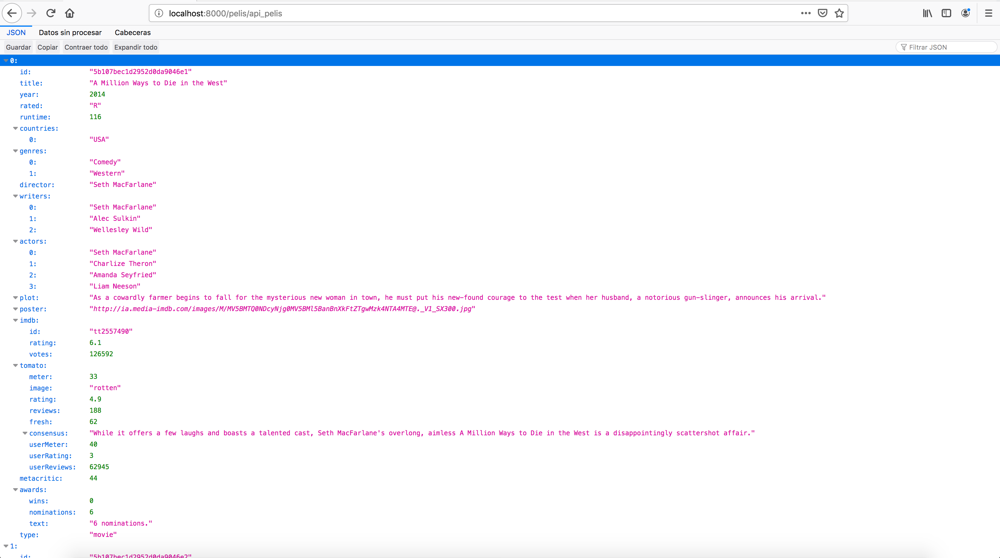

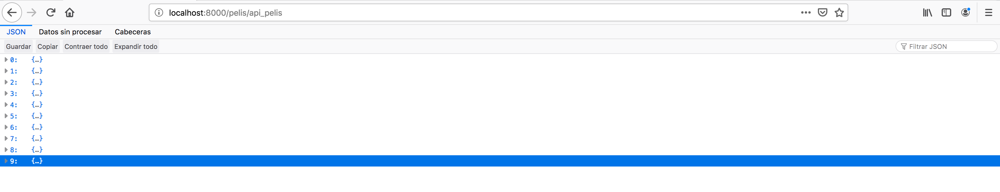

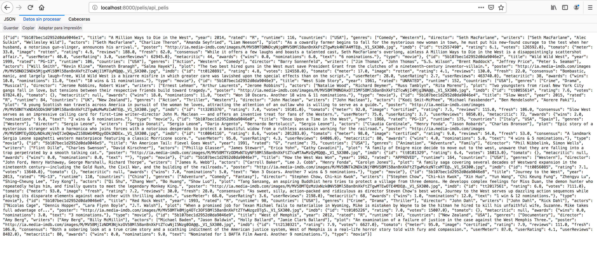

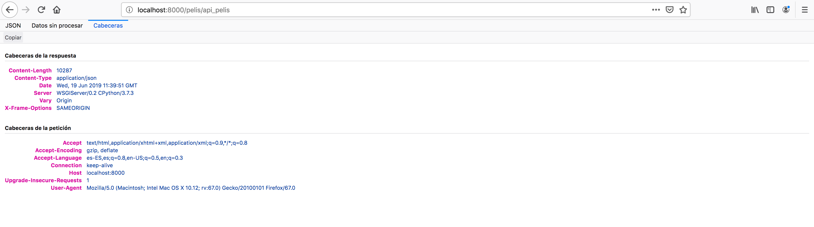

#### api_peli(request, id)

~~~python
# pelis/views.py

def api_peli(request, id):

	'''
	Función para la API que permite listar todas las películas (GET),
	modificarlas (PUT) y/o borrarlas (DELETE)
	'''

	try:
		peli = Pelis.objects().get(id=id)
	except:
		return HttpResponse(status=404)  # No encontrado

	# Método para listar
	if request.method == 'GET':
		serializer = PelisSerializer(peli)
		return JsonResponse(serializer.data)

	# Método para modificar
	if request.method == 'PUT':
		data = JSONParser().parse(request)
		serializer = PelisSerializer(data=data)

		peli.title 		 = data.title
		peli.title       = data.title
		peli.year        = data.year
		peli.rated       = data.rated
		peli.runtime     = data.runtime
		peli.countries   = data.countries
		peli.genres      = data.genres
		peli.director    = data.director
		peli.writers     = data.writers
		peli.actors      = data.actors
		peli.plot        = data.plot
		peli.poster      = data.poster
		peli.imdb        = data.imdb
		peli.tomato      = data.tomato
		peli.metacritic  = data.metacritic
		peli.awards      = data.awards
		peli.type        = data.type

		peli.save()
		return JsonResponse(serializer.data, status=200)

	# Método para borrar
	if request.method == 'DELETE':
		peli.delete()
		return HttpResponse(status=200)  # No encontrado
~~~

Entonces accediendo a http://localhost:8000/pelis/api_peli/5b107bec1d2952d0da90471f, en donde hemos cogido que el ID de la película sea _5b107bec1d2952d0da90471f_, podemos visualizar de primeras el siguiente contenido:

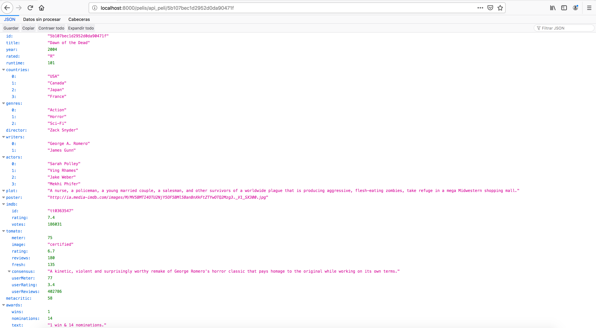

Se puede comprobar la información de dicha película a partir de su identificador, con la vista creada en CSS para mostrar el contenido de las películas.

Además, es posible hacer uso de dicha visualización haciendo uso del comando `curl`:

~~~shell
# Para visualizar
$ curl http://localhost:8000/pelis/api_peli/5b107bec1d2952d0da90471f
~~~

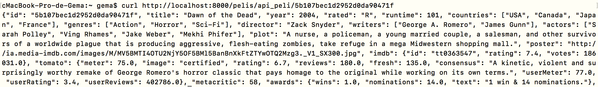

Sin embargo, hay que tener en cuenta que siempre automáticamente se va a hacer uso de GET. A continuación, se pueden ver las URL para realizar alguna de las otras operaciones:

~~~shell
pelis/ api_pelis [name='api_pelis']
pelis/ api_peli/<id> [name='api_peli']
pelis/ api ^pelis/$ [name='peli-list']
pelis/ api ^pelis\.(?P<format>[a-z0-9]+)/?$ [name='peli-list']
pelis/ api ^pelis/(?P<id>[^/.]+)/$ [name='peli-detail']
pelis/ api ^pelis/(?P<id>[^/.]+)\.(?P<format>[a-z0-9]+)/?$ [name='peli-detail']
pelis/ api ^$ [name='api-root']
pelis/ api ^\.(?P<format>[a-z0-9]+)/?$ [name='api-root']
~~~

----

### APIS desde clases viewsets

Seguimos ahora [Django + MongoDB = Django REST Framework Mongoengine](https://medium.com/@vasjaforutube/django-mongodb-django-rest-framework-mongoengine-ee4eb5857b9a) para incluir respuesta desde las clases que incluye DRF. En un nuevo archivo **viewsets.py**:

~~~python
# pelis/viewsets.py

from rest_framework_mongoengine import viewsets
from .model import Pelis
from .serializers import PelisSerializer

class PelisViewSet(viewsets.ModelViewSet):
		queryset = Pelis.objetcs.all()[:10]
		lookup_field = 'id' # el identficador de cada película
		serializer_class = PelisSerializer
~~~

Con ello lo que se pretende es que todas las API se hagan desde aquí. A continuación, añadimos a **urls.py**:

~~~python
# pelis/urls.py

from django.conf.urls import include, url
from rest_framework import routers
from .viewsets import PelisViewSet
...

router = routers.DefaultRouter()
router.register('pelis', PelisViewSet, 'peli')

urlpatterns = [
	url('api', include(router.urls)), # Incluye todo el API CRUD
   ...
]
~~~

Como se ha comprobado antes, es complicado hacer uso de la API para PUT, GET y POST de la anterior manera, es por eso que DJANGO REST Framework, nos ofrece una mejora.

En el terminal hacemos `docker-compose exec web python manage.py shell` y ponemos la siguiente URL en el navegador http://localhost:8000/pelis/apipelis/ lo que nos muestra un JSON. Éste es el automático que hace DJANGO REST Framework.

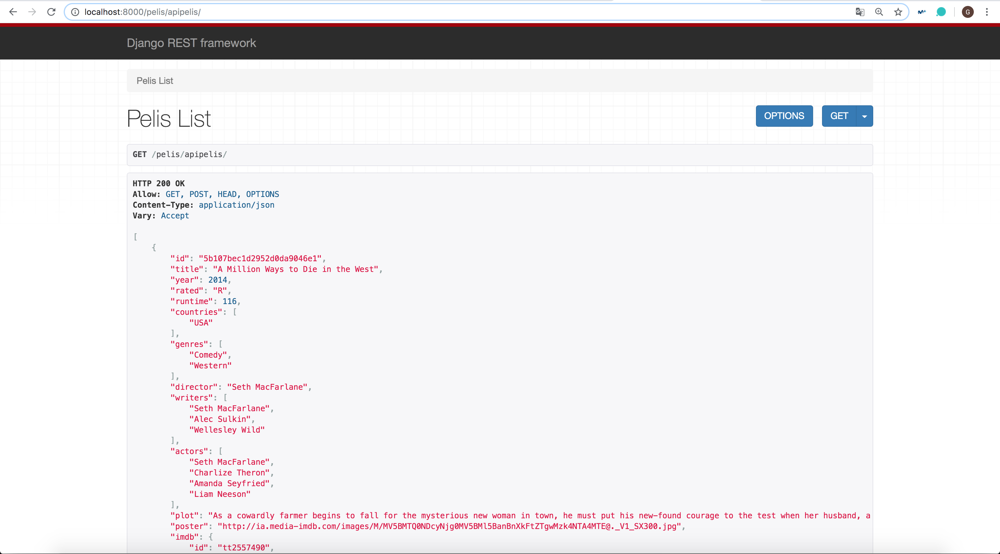

Si ponemos "localhost:8000/api_pelis/<id>" (http://localhost:8000/pelis/apipelis/5b107bec1d2952d0da90471f/), nos aparecerá el API para dicha película:

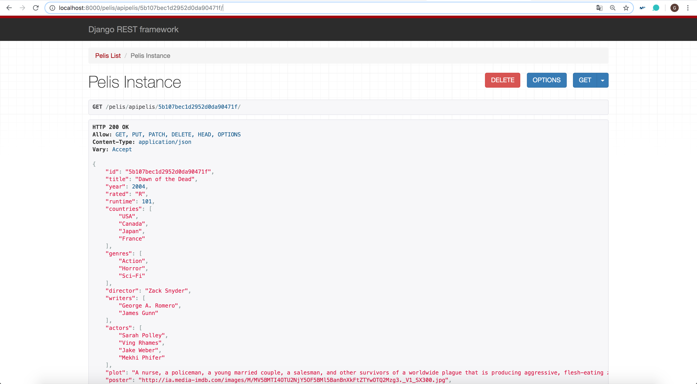

Todo esto que hacemos es haciendo uso solo con el GET, ¿pero que pasa con el POST, DELETE y PUT?

#### PUT

Estamos con la misma película (_5b107bec1d2952d0da90471f_) y bajamos la misma página que acabamos de ver. Como se aprecia están los campos con la información sobre la película, dichos cambios son editables:

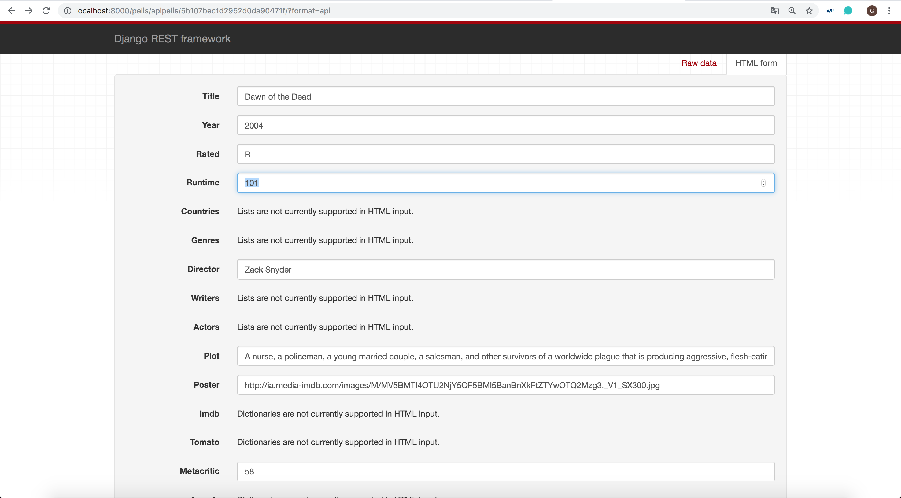

Vamos a cambiar el campo "Runtime" que está a 101 minutos a 30 minutos.

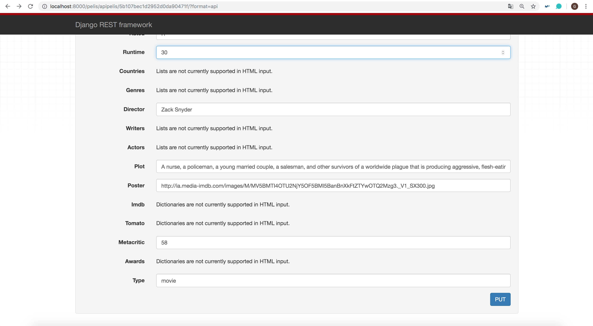

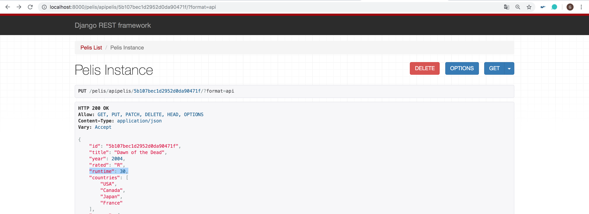

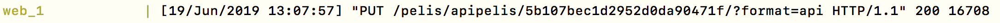

#### POST

Sin embargo, también es posible añadir nuevas películas a la base de datos como se puede comprobar a continuación (http://localhost:8000/pelis/apipelis/):

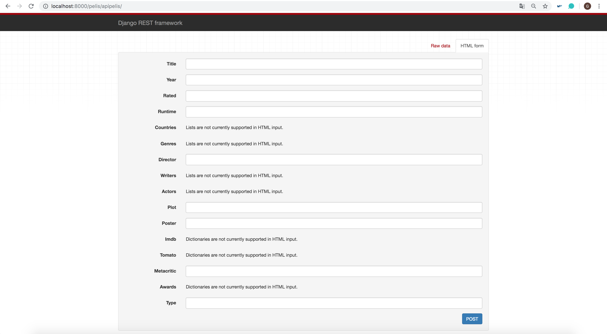

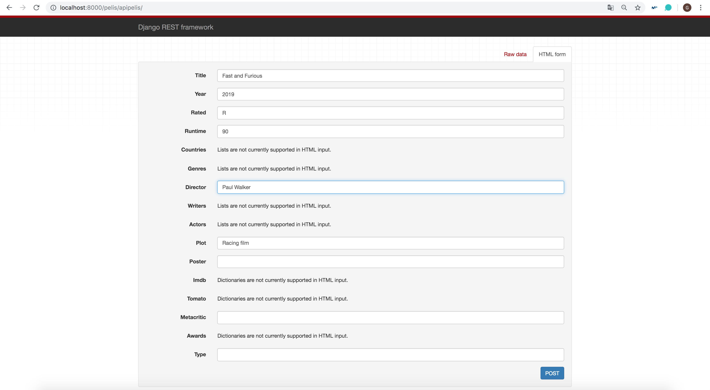

#### DELETE

Simplemente hace falta pulsar en el botón de DELETE, para eliminar la película de nuestra base de datos.

Además, nos aparece la siguiente información si introducimos un ID que no existe en la base de datos:

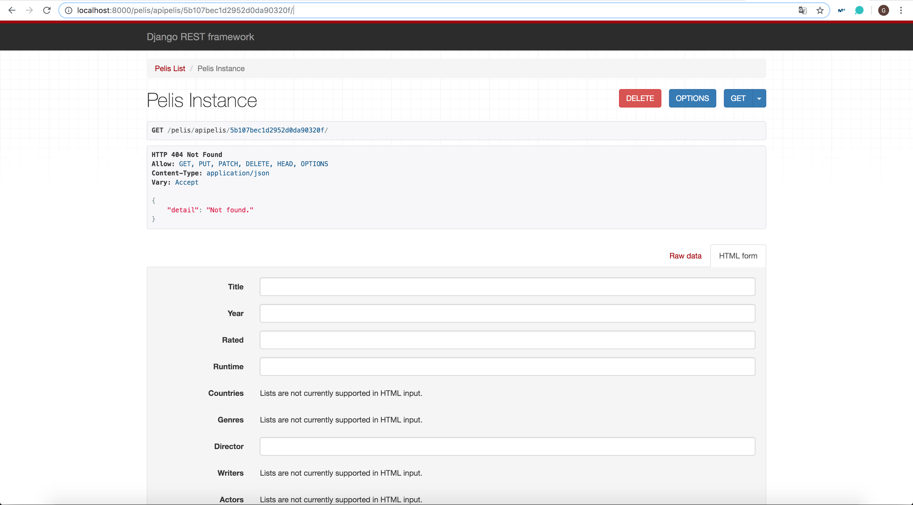

Pero esto puede tener un inconveniente con la autentificación, al realizar un determinado tipo de acciones. De todas, se ha obtenido esta API que será la que la app móvil llame.
