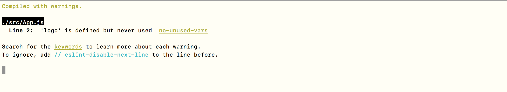
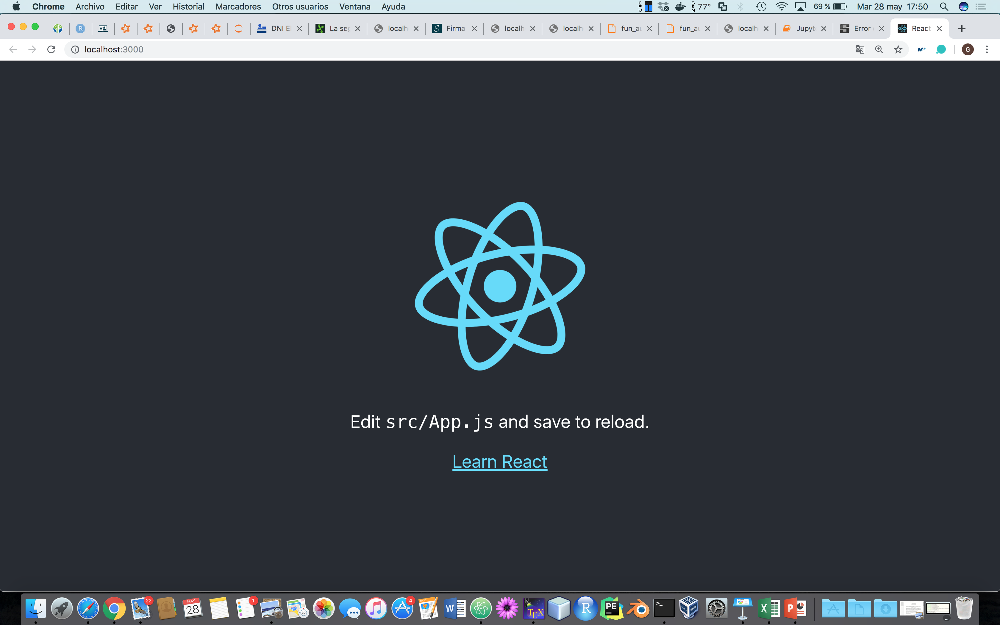
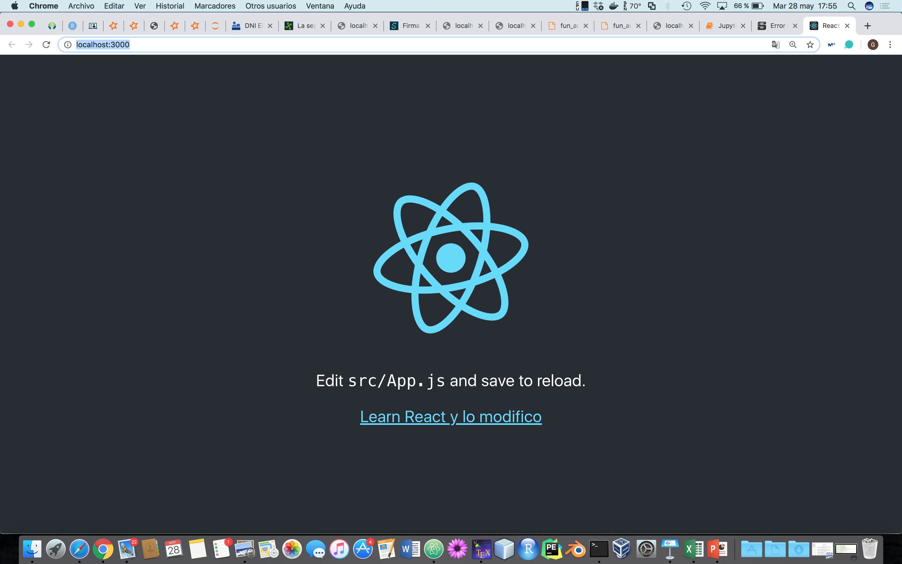
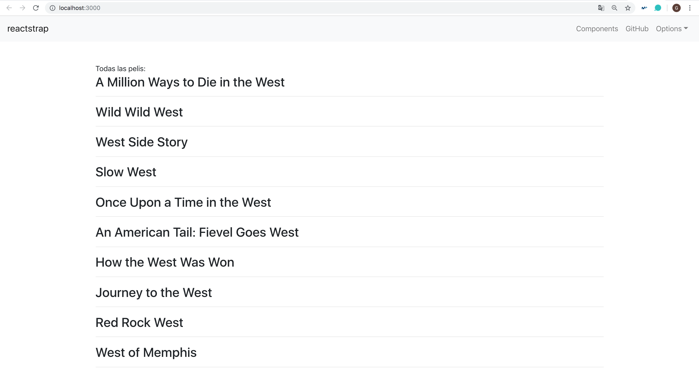

## Tarea 13: Single Page Application con React

Para realizar esta tarea el profesor está siguiente el siguiente enlace: https://wsvincent.com/django-rest-framework-react-tutorial/, pero dice que está antiguado.

Lo primero que tenemos que hacer es instalar en el **requirements.txt**: `django-cors-headers`, por lo que necesitamos volver hacer `docker-compose build`. A continuación, nos vamos a **settings.py** y añadimos:

~~~
INSTALLED_APPS = [
  'corsheaders'
]

....

# añadimos al MIDDLEWARE
MIDDLEWARE = [
  'corsheaders.middleware.CorsMiddleware', # new
  'django.middleware.common.CommonMiddleware', # new
    ...
]

...

CORS_ORIGIN_WHITELIST = [
  'http://localhost:3000'
]
~~~

### Instalando REACT

Ahora, debemos instalar todo el **ecosistema de react**. Por lo que instalamos todo el ecosistema con `create-react-app`, que además incluye un servidor de desarrollo. Entonces, nos vamos a la carpeta de **código** (`cd codigo/`) y hacemos:

~~~
> sudo npm install -g create-react-app
> create-react-app frontend
> cd frontend
> npm install react-router-dom
> npm install bootstrap
> npm install reactstrap
> npm start
~~~

Una vez que hacemos `npm start`, se nos abre http://localhost:3000/:

En la carpeta **frontend > src > App.js** pegamos:

~~~
import React from 'react';
import logo from './logo.svg';
import './App.css';

function App() {
  return (
    

      <header className="App-header">
        
        

          Edit <code>src/App.js</code> and save to reload.
        

        <a
          className="App-link"
          href="https://reactjs.org"
          target="_blank"
          rel="noopener noreferrer"
        >
          Learn React
        </a>
      </header>
    

  );
}

export default App;
~~~

Se puede cambiar el texto de **Learn React** por cualquier otra cosa como _Learn React y lo modifico_:

Salimos de la aplicación con CTRL + C y nos instalamos:

~~~
> npm install react-router-dom
> npm install bootstrap
> npm install reactstrap
~~~

Acabamos de instalar todo esto, es decir, hemos instalado **bootstrap para react**, tal como viene en _reacstrap_. Incluimos también **react-router**, tal como en **react trainig / reac router**. Ampliamos entonces el archivo `index.js` para incluir el router y bootstrap.

El fichero **frontend > src > index.js** es el primero que se ejecuta, viene con el siguiente contenido:

~~~
import React from 'react';
import ReactDOM from 'react-dom';
import './index.css';
import App from './App';
import * as serviceWorker from './serviceWorker';

ReactDOM.render(<App />, document.getElementById('root'));

// If you want your app to work offline and load faster, you can change
// unregister() to register() below. Note this comes with some pitfalls.
// Learn more about service workers: https://bit.ly/CRA-PWA
serviceWorker.unregister();
~~~

Añadimos a dicho fichero:

~~~~
import React from 'react';
import ReactDOM from 'react-dom';
import './index.css';
import App from './App';
import * as serviceWorker from './serviceWorker';

# AÑADIMOS LAS SIGUIENTES LÍNEAS
import { BrowserRouter } from 'react-router-dom'
import 'bootstrap/dist/css/bootstrap.min.css';

// ReactDOM.render(<App />, document.getElementById('root'));

ReactDOM.render(
	<BrowserRouter>
		<App />
	</BrowserRouter>,
    document.getElementById('root'))

// If you want your app to work offline and load faster, you can change
// unregister() to register() below. Note this comes with some pitfalls.
// Learn more about service workers: https://bit.ly/CRA-PWA
serviceWorker.unregister();
~~~~

Con **BrowserRouter**, lo que se hace es llamar a **App.js**. Luego copiamos y pegamos de aquí https://reactstrap.github.io/components/navbar/. También, se ha puesto también el navbar de Bootstrap:

~~~
export default class App extends React.Component {

  // aquí va la clase del navbar: https://reactstrap.github.io/components/navbar/

  // el constructor lo que hace es poner la variable this.toggle.bind(this)
  // como unas variables globales

  constructor(props) {
    super(props);

    this.toggle = this.toggle.bind(this);
    this.state = {
      isOpen: false
    };
  }

  toggle() {
    this.setState({
      isOpen: !this.state.isOpen
    });
  }

  // y nos falta el return que es el que dibuja
  render() {
    return (
      

        <Navbar color="light" light expand="md">
          <NavbarBrand href="/">reactstrap</NavbarBrand>
          <NavbarToggler onClick={this.toggle} />
          <Collapse isOpen={this.state.isOpen} navbar>
            <Nav className="ml-auto" navbar>
              <NavItem>
                <NavLink href="/components/">Components</NavLink>
              </NavItem>
              <NavItem>
                <NavLink href="https://github.com/reactstrap/reactstrap">GitHub</NavLink>
              </NavItem>
              <UncontrolledDropdown nav inNavbar>
                <DropdownToggle nav caret>
                  Options
                </DropdownToggle>
                <DropdownMenu right>
                  <DropdownItem>
                    Option 1
                  </DropdownItem>
                  <DropdownItem>
                    Option 2
                  </DropdownItem>
                  <DropdownItem divider />
                  <DropdownItem>
                    Reset
                  </DropdownItem>
                </DropdownMenu>
              </UncontrolledDropdown>
            </Nav>
          </Collapse>
        </Navbar>

          
        

          Aqui ponemos más componentes
        

      

    );
  }

}
~~~

Vamos a la URL de la API creada en la Tarea 12 (http://localhost:8000/pelis/api_pelis), y extraemos las películas. A partir de ahí, nos creamos una carpeta nueva en **frontend > src > components** y vamos hacer el _componente de "todas"_. El componente `Todas`, hará una llamada GET a la API, para traerse una lista de las diez primeras películas justo después de montarse. Creamos una nueva clase Component de react en el archivo:

~~~
# Todas.js

// components/App.js
import React, { Component } from 'react'
import Peli from './Peli'

export default class Todas extends Component {

  constructor(props) {
    super(props)
    this.state = {                // variable estado de la clase, lista de películas
      pelis: [{title: 'el bueno el feo y el malo'}]
     }
  }

  // llamada al API
  componentDidMount() {
    fetch('http://localhost:8000/pelis/api_pelis')  // o el que sea (el fetch es un get)
      .then(res => { return res.json()})
      .then(data => {
        console.log(data)
        this.setState({pelis:data})
      }).catch(error => {
        console.log(error)
      })

    }

  render() {

    return (
      

      Todas las pelis:  
        {this.state.pelis.map(peli => {  // arrow function
          return (
            <Peli peli={peli}/>
          )
        })
      }
      

    )
  }
}
~~~

Luego nos creamos el fichero **frontend > src > components > Peli.js**, es decir, vamos a llamar a otro componente, Peli, para mostrar los detalles de cada película:

~~~
// components/Peli.js
import React, { Component } from 'react'

export default class Peli extends Component {

	render() {

	var peli = this.props.peli   // props desde el componente de arriba
	return(
	   

	      <h3>{peli.title}</h3>

	      

	   

	  )
	}
}
~~~

Y en http://localhost:3000/ visualizamos:

