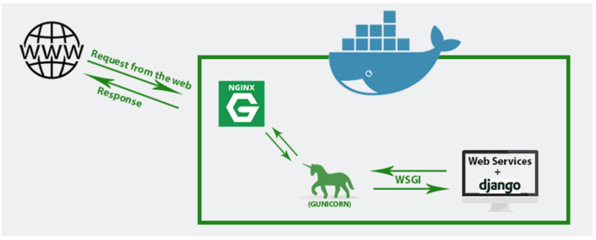

## Tarea 14: Producción

> **Pincha [aquí](https://github.com/Gecofer/MII_SSBW_1819/blob/master/Tarea%2014/Tarea14.md) para ver cómo se hizo la Tarea 14**

Hasta ahora hemos usado un entorno de desarrollo, aunque muy parecido al de producción al usar contenendores. No obstante para el despliegue de la versión definitiva de producción tendremos que:

### Substituir el servidor web de Django

Primero habra que desactivar el ambiente de depuración poniendo en el archivo **settings.py**:

~~~python
DEBUG = False

ALLOWED_HOSTS = ['*']
~~~

El servidor `runsever` no está pensado para producción, sí que tendremos que substiuirlo por otro, tan como dice en [Deploying Django](https://docs.djangoproject.com/en/2.2/howto/deployment/). Un servidor que podemos usar es [gunicorn](https://docs.djangoproject.com/en/2.2/howto/deployment/wsgi/gunicorn/), que debería estar monitorizado y supervisado por algunos de los métodos que dice en: [Monitoring](http://docs.gunicorn.org/en/latest/deploy.html#monitoring)

Con esto dejará de funcionar el servidor de desarrollo, y de servir los contenidos de **/static**, que tendrán que pasar a servirse desde el servidor web de producción. Django tiene un script: [collectstatic](https://docs.djangoproject.com/en/2.2/ref/contrib/staticfiles/) para facilitar pasar los contenidos a otro directorio.

En la [Documentación de Django](https://docs.djangoproject.com/en/2.2/howto/deployment/), y en [Django, Gunicorn, Nginx y Supervisor](https://rukbottoland.com/blog/django-gunicorn-nginx-supervisor/) encontramos una guía de como hacerlo.

### Generar y desplegar la Single Page Application
La SPA son archivos que se geneneran con:

~~~
npm build
~~~

y se pueden servir desde cualquier servidor web, o cdn: [aws s3](https://www.fullstackreact.com/articles/deploying-a-react-app-to-s3/), [github](https://codeburst.io/deploy-react-to-github-pages-to-create-an-amazing-website-42d8b09cd4d), [heroku](https://daveceddia.com/deploy-react-express-app-heroku/), [google cloud](https://medium.com/google-cloud/how-to-deploy-a-static-react-site-to-google-cloud-platform-55ff0bd0f509), etc.
