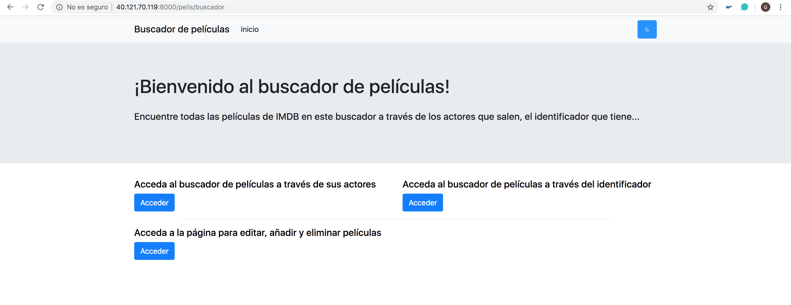
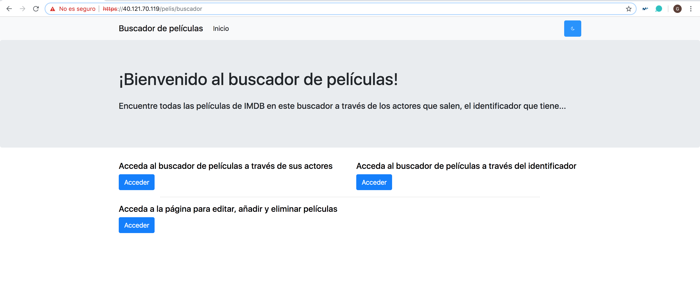

## Tarea 14: Producción

En producción no usaremos el servidor de desarrollo de Django sino una aplicación dedicada a servir nuestro contenido, [gunicorn](https://gunicorn.org/). Para ello, lo primero que se debe hacer es instalarlo en el **requirements.txt**:

~~~
gunicorn==19.9.0
~~~

Seguidamente, se deben de hacer algunas pequeñas modificaciones en los ficheros **settings.py** y **docker-compose.yml**. Para su modificación, se ha hecho uso de los siguientes tutoriales:

- [Docker-compose Nginx + Django + Gunicorn](https://gist.github.com/emmettna/b78f54a6683b06a2a2da21db7580a8d6#file-docker-compose-nginx-django-gunicorn)
- [Configurar Django con Nginx, Gunicorn, virtualenv, supervisor y PostgreSQL](https://wildunix.es/posts/configurar-django-con-nginx-gunicorn-virtualenv-supervisor-y-postgresql/)
- [Setting up Django with Nginx, Gunicorn, virtualenv, supervisor and PostgreSQL](http://michal.karzynski.pl/blog/2013/06/09/django-nginx-gunicorn-virtualenv-supervisor/)
- [Deploying django application to a production server part II](https://medium.com/@_christopher/deploying-my-django-app-to-a-real-server-part-ii-f0c277c338f4)
- [Tutorial de Django Parte 11: Desplegando Django a producción](https://developer.mozilla.org/es/docs/Learn/Server-side/Django/Deployment)
- [Django, Gunicorn, Nginx y Supervisor](https://rukbottoland.com/blog/django-gunicorn-nginx-supervisor/)
- [Run a Django app with Gunicorn in Ubuntu 16.04 (Part I)](http://rahmonov.me/posts/run-a-django-app-with-gunicorn-in-ubuntu-16-04/)
- [Managing static files (e.g. images, JavaScript, CSS)](https://docs.djangoproject.com/en/2.1/howto/static-files/)
- [How to use Django with Gunicorn](https://docs.djangoproject.com/en/2.2/howto/deployment/wsgi/gunicorn/)

### Substituir el servidor web de Django

#### docker-compose.yml

Cuando hacíamos uso del servidor Django para lanzar la aplicación, teníamos que hacer `python manage.py runserver 0.0.0.0:8000`, sin embargo, para uso de gunicorn y tal como viene en los siguientes tutoriales, se ha modificado por:

~~~
...

  web:
    build: .
    command: bash -c "python manage.py makemigrations && python manage.py migrate && gunicorn composeexample.wsgi -b 0.0.0.0:8000"
    # command: python manage.py runserver 0.0.0.0:8000
    volumes:
      - .:/code
    ports:
      - "8000:8000"
    links:
      - mongo
    depends_on:
      - mongo
~~~

El servidor `runsever` no está pensado para producción, sí que tendremos que substiuirlo por otro, tan como dice en [Deploying Django](https://docs.djangoproject.com/en/2.2/howto/deployment/). Un servidor que podemos usar es [gunicorn](https://docs.djangoproject.com/en/2.2/howto/deployment/wsgi/gunicorn/), que debería estar monitorizado y supervisado por algunos de los métodos que dice en: [Monitoring](http://docs.gunicorn.org/en/latest/deploy.html#monitoring)

#### settings.py

También se debe de desactivar el ambiente de depuración poniendo en el archivo **settings.py**:

~~~python
# SECURITY WARNING: don't run with debug turned on in production!
# DEBUG = True
DEBUG = False

# ALLOWED_HOSTS = []
ALLOWED_HOSTS = ['*']
~~~

Con esto dejará de funcionar el servidor de desarrollo, y de servir los contenidos de **/static**, que tendrán que pasar a servirse desde el servidor web de producción. Django tiene un script: [collectstatic](https://docs.djangoproject.com/en/2.2/ref/contrib/staticfiles/) para facilitar pasar los contenidos a otro directorio.

~~~python
# The URL to use when referring to static files (where they will be served from)
STATIC_URL = '/static/'
STATIC_ROOT = os.path.join(BASE_DIR, STATIC_URL)
~~~

### Generar y desplegar la aplicación en Azure

Hasta ahora hemos hecho uso de la aplicación de manera local, por lo que lo último que vamos hacer es desplegarla en Microsoft Azure, para ello nos hemos generado un script que nos crea un máquina virtual:

~~~script
#!/bin/bash

# Creación del grupo de recursos con localización en el este de EE.UU.
echo " ------ Creación del grupo de recursos ------ "
az group create --name myResourceGroup-eastus --location eastus

# Creación de una red virtual llamada myVnet y una subred llamada mySubnet
echo " ------ Creación de la red virtual ------ "
az network vnet create  --resource-group myResourceGroup-eastus --name myVnet --address-prefix 10.0.0.0/16 --subnet-name mySubnet --subnet-prefix 10.0.1.0/24

# Creación de la máquina virtual - Obtenemos la IP
echo " ------ Creación de la máquina virtual ------ "
IP=$(az vm create  --resource-group myResourceGroup-eastus --name MV --image UbuntuLTS --admin-username gemazure --generate-ssh-keys --storage-sku Standard_LRS --public-ip-address-allocation static --vnet-name MyVnet --subnet mySubnet | jq -r '.publicIpAddress')

# Cambiamos el tamaño a la máquina virtual
echo " ------ Cambiando el tamaño a la máquina virtual ------ "
az vm resize --resource-group myResourceGroup-eastus --name MV --size Standard_B1s

# Abrimos el puerto 80
echo " ------ Abrimos el puerto 80 ------ "
az vm open-port --port 80 --resource-group myResourceGroup-eastus --name MV --priority 300
az vm open-port --port 8000 --resource-group myResourceGroup-eastus --name MV --priority 400
az vm open-port --port 8081 --resource-group myResourceGroup-eastus --name MV --priority 500
az vm open-port --port 443 --resource-group myResourceGroup-eastus --name MV --priority 600
az vm open-port --port 3000 --resource-group myResourceGroup-eastus --name MV --priority 700

# Una vez creada la máquina virtual, mostramos su nombre y su dirección IP
echo " ------ Datos de la máquina virtual creada ------ "
echo -name: MV
echo -ip: $IP

# Conectarnos a la máquina virtual - 40.121.70.119
# ssh gemazure@$IP

# Instalar docker
# sudo apt install docker.io

# Instalar docker-compose
# https://www.digitalocean.com/community/tutorials/how-to-install-docker-compose-on-ubuntu-16-04
# sudo curl -L https://github.com/docker/compose/releases/download/1.18.0/docker-compose-`uname -s`-`uname -m` -o /usr/local/bin/docker-compose
# sudo chmod +x /usr/local/bin/docker-compose
# docker-compose --version

# Descargar el repo de Github
# git clone https://github.com/Gecofer/MII_SSBW_1819.git

# Ponerlo en funcionamiento
# cd MII_SSBW_1819/codigo/
# sudo docker-compose up --build
~~~

Y simplemente tenemos que acceder a http://40.121.70.119:8000/pelis/buscador o a https://40.121.70.119/pelis/buscador:

