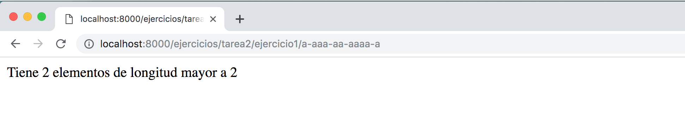
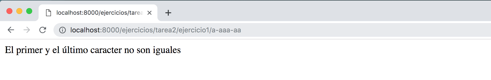
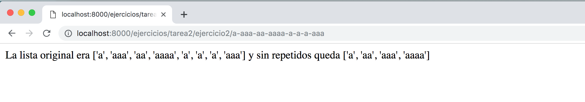
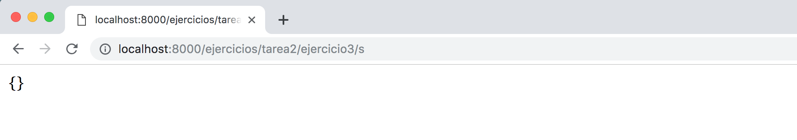
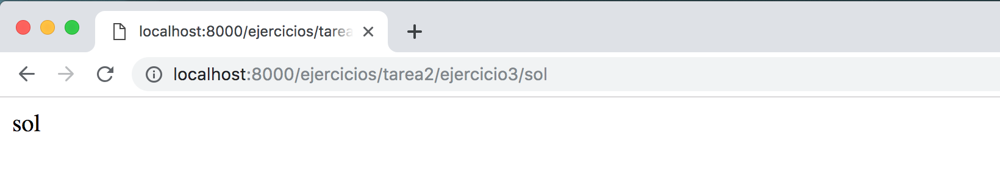
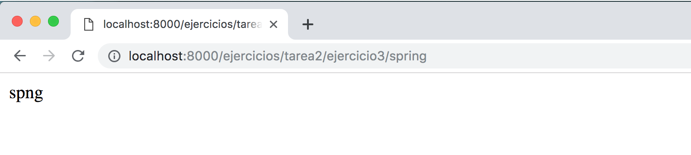
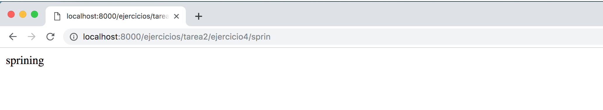
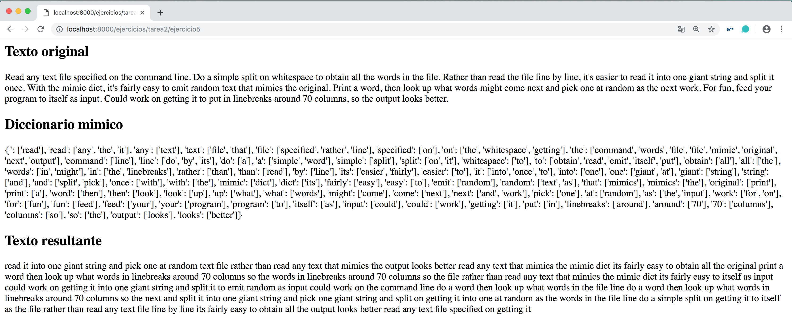

## Tarea 2: Ejercicios de Python

- [Ejercicio 1](#ej1)
- [Ejercicio 2](#ej2)
- [Ejercicio 3](#ej3)
- [Ejercicio 4](#ej4)
- [Ejercicio 5](#ej5)

### Ejercicio 1 

Dada una lista de string, devuelve la cuenta del número de string donde la longitud del string es 2 o más y la primera y la última letra del string son la misma.

Nota: python no tiene un operador ++, pero += funciona.

~~~python
# urls.py

# entrada str, lista separada por espacios, guiones o comas
path('tarea2/ejercicio1/<lista>', views.tarea2_ejercicio1),
~~~

~~~python
# views.py

def tarea2_ejercicio1(request, lista):

    '''
    Given a list of strings, return the count of the number of
    strings where the string length is 2 or more and the first
    and last chars of the string are the same.

    Note: python does not have a ++ operator, but += works.
    '''

    # http://localhost:8000/ejercicios/tarea2/ejercicio1/a-aaa-aa-aaaa-a
    # Tiene 2 elementos de longitud mayor a 2

    # En algún momento, puede que se necesite romper una cadena grande en una
    # más pequeña. Para ello, se utiliza la función "split". Lo que hace
    # es dividir o romper una cadena y añadir los datos a una matriz de
    # cadenas usando un comando separador definido. Si no se define ningún
    # separador cuando se llama a la función, se utilizarán los espacios en
    # blanco por defecto. En términos más sencillos, el
    # separador es un carácter definido que se colocará entre cada variable
    entrada = lista.split("-") # ponemos como separado un guión

    cont = 0

    # Comprobamos que el primer y el último carácter son iguales
    if entrada[0] == entrada[-1]:
        # Iteramos sobre la lista y obtenemos el recuento del número de string
        # donde la longitud de la cadena es de 2 o más
        for elem in entrada:
            if len(elem)>2:
                cont = cont + 1

        salida = '''
                    <html>
                        Tiene %d elementos de longitud mayor a 2
                    </html>
                 ''' % (cont)

    # El primer y el último caracter no son iguales --> no hacemos nada
    else:
        salida = '''
                    <html>
                        El primer y el último caracter no son iguales
                    </html>
                 '''

    return (HttpResponse(salida)) # Devolvemos la variable para HTTP
~~~

Hemos cogido la siguiente lista _a-aaa-aa-aaaa-a_, y se puede apreciar que existen solo dos ítems de la lista con dos elementos mayor a dos: _aaa_ y _aaaa_

- http://localhost:8000/ejercicios/tarea2/ejercicio1/a-aaa-aa-aaaa-a

  

Por otro lado, para poder obtener el número de elementos que tiene la lista mayor a dos, dicha lista debe tener el primer y el último carácter igual: _a-aaa-aa_

- http://localhost:8000/ejercicios/tarea2/ejercicio1/a-aaa-aa

    

### Ejercicio 2 

Dada una lista de números, devuelve una lista donde todos los elementos adyacentes == se han reducido a un solo elemento, así que[1, 2, 2, 3] devuelve[1, 2, 3]. Puede crear una nueva lista o modificar la lista pasada.

~~~python
# urls.py

# entrada str, lista separada por espacios, guiones o comas
path('tarea2/ejercicio2/<lista>', views.tarea2_ejercicio2),
~~~

~~~python
# views.py

def tarea2_ejercicio2(request, lista):

    '''
    Given a list of numbers, return a list where
    all adjacent == elements have been reduced to a single element,
    so [1, 2, 2, 3] returns [1, 2, 3]. You may create a new list or
    modify the passed in list.
    '''

    # http://localhost:8000/ejercicios/tarea2/ejercicio2/a-aaa-aa-aaaa-a-a-a-aaa
    # La lista original era ['a', 'aaa', 'aa', 'aaaa', 'a', 'a', 'a', 'aaa'] y
    # sin repetidos queda ['a', 'aa', 'aaa', 'aaaa']

    # Guardamos la lista de entrada
    entrada_con_repetidos = lista.split("-")

    # Usamos la función "split" para añadir los datos a una matriz de
    # cadenas usando un comando separador definido (guiones)
    entrada = set(lista.split("-"))

    # Ordenamos esa lista
    entrada = sorted(entrada)

    salida = '''<html>
                    La lista original era %s y sin repetidos queda % s
                </html>
              ''' % (entrada_con_repetidos, entrada)

    return (HttpResponse(salida)) # Devolvemos la variable para HTTP
~~~

Por ejemplo, la lista original es ['a', 'aaa', 'aa', 'aaaa', 'a', 'a', 'a', 'aaa'] y sin repetidos queda ['a', 'aa', 'aaa', 'aaaa'].

- http://localhost:8000/ejercicios/tarea2/ejercicio2/a-aaa-aa-aaaa-a-a-a-aaa

  

### Ejercicio 3 

Dada una cadena s, devuelve una cadena hecha de los 2 primeros y los 2 últimos caracteres de la cadena original, de modo que 'spring' produce 'spng'. Sin embargo, si la longitud de la cadena es inferior a 2, devuelva en su lugar la cadena vacía.

~~~python
# urls.py

# entrada str
path('tarea2/ejercicio3/<entrada>', views.tarea2_ejercicio3),
~~~

~~~python
# views.py

def tarea2_ejercicio3(request, entrada):

    '''
    Given a string s, return a string made of the first 2
    and the last 2 chars of the original string,
    so 'spring' yields 'spng'. However, if the string length
    is less than 2, return instead the empty string.
    '''

    # http://localhost:8000/ejercicios/tarea2/ejercicio3/s
    # {}

    # http://localhost:8000/ejercicios/tarea2/ejercicio3/sol
    # sol

    # http://localhost:8000/ejercicios/tarea2/ejercicio3/sola
    # sola

    # http://localhost:8000/ejercicios/tarea2/ejercicio3/spring
    # spng

    # http://localhost:8000/ejercicios/tarea2/ejercicio3/clase
    # clse

    # Si la cadena es menor a 2, devolvemos vacío
    if len(entrada) < 2:
        entrada = {}
    # Si la cadena es 3 ó 4, devolvemos la palabras
    elif (len(entrada) == 3 or len(entrada)) == 4:
        entrada = entrada
    # Si la cadena es mayor a 4
    elif len(entrada) > 4:
        entrada = entrada[0] + entrada[1] + entrada[-2] + entrada[-1]

    salida = '%s' % (entrada)

    return (HttpResponse(salida)) # Devolvemos la variable para HTTP
~~~

Si ponemos a la entrada, una cadena con longitud inferior a 2, devolvemos a la salida una lista vacía.

- http://localhost:8000/ejercicios/tarea2/ejercicio3/s

  

Si ponemos a la entrada, una cadena con longitud igual a 2, 3 ó 4, devolvemos a la salida la misma cadena que se ha introducido.  

- http://localhost:8000/ejercicios/tarea2/ejercicio3/sol

  

Si introducimos por entrada _spring_, la salido escribe _spng_, es decir, la nueva cadena está compuesta por los 2 primeros y los 2 últimos caracteres de la cadena original.

- http://localhost:8000/ejercicios/tarea2/ejercicio3/spring

  

### Ejercicio 4 

Dada una cadena, si su longitud es de al menos 3, añada 'ing' a su extremo. A menos que ya termine en "ing", en cuyo caso añada "ly" en su lugar. Si la longitud de la cadena es inferior a 3, no la cambie.

~~~python
# urls.py

# entrada str
path('tarea2/ejercicio4/<entrada>', views.tarea2_ejercicio4),
~~~

~~~python
# views.py

def tarea2_ejercicio4(request, entrada):

    '''
    Given a string, if its length is at least 3,
    add 'ing' to its end.
    Unless it already ends in 'ing', in which case
    add 'ly' instead.
    If the string length is less than 3, leave it unchanged.
    '''

    # http://localhost:8000/ejercicios/tarea2/ejercicio4/spring
    # springly

    # http://localhost:8000/ejercicios/tarea2/ejercicio4/sprin
    # sprining

    # Dada una cadena, si su longitud es de al menos 3
    if (len(entrada) >= 3):
        # Si no termina en "ing" añadir "ing" al final
        if (entrada[-3:] != "ing" ):
            entrada = entrada + "ing"
        # Si termina en "ing", añadir "ly" al final
        elif (entrada[-3:] == "ing" ):
            entrada = entrada + "ly"

    # Si la longitud de la cadena es inferior a 3, no cambie la palabra
    else:
        entrada = entrada

    salida = '%s' % (entrada)

    return (HttpResponse(salida)) # Devolvemos la variable para HTTP
~~~

Si la palabra no termina en _ing_ añadir __ing__ al final:

  - http://localhost:8000/ejercicios/tarea2/ejercicio4/sprin

    

Si la palabra termina en _ing_, añadir __ly__ al final:

- http://localhost:8000/ejercicios/tarea2/ejercicio4/spring

  

### Ejercicio 5 

Lea cualquier archivo de texto especificado en la línea de comandos. Haga un simple split() en un espacio en blanco para obtener todas las palabras del archivo. En lugar de leer el archivo línea por línea, es más fácil leerlo en una cadena gigante y dividirlo una vez.

Cree un dictado "mímico" que asigna cada palabra que aparece en el archivo a una lista de todas las palabras que siguen inmediatamente a esa palabra en el archivo. La lista de palabras puede estar en cualquier orden y debe incluir duplicados. Así, por ejemplo, la clave "y" podría tener la lista ["entonces", "mejor", "entonces", "después", ....] que enumera todas las palabras que vinieron después de "y" en el texto. Diremos que la cadena vacía es lo que precede a la primera palabra del archivo.

Con el dictado mímico, es bastante fácil emitir texto aleatorio que imita al original. Escriba una palabra, luego busque las palabras que podrían aparecer a continuación y elija una al azar como el siguiente trabajo. Usa la cadena vacía como primera palabra para preparar las cosas. Si alguna vez nos quedamos atascados con una palabra que no está en el dictado, volvamos a la cadena vacía para mantener las cosas en movimiento.

Nota: el módulo estándar de python 'random' incluye un método random.choice(list) que selecciona un elemento aleatorio de una lista no vacía.

Para divertirse, alimente su programa a sí mismo como entrada. Podríamos trabajar para ponerlo en saltos de línea alrededor de 70 columnas, para que la salida se vea mejor.

~~~python
# urls.py

# Ninguna entrada, leemos un fichero en la función
path('tarea2/ejercicio5', views.tarea2_ejercicio5),
~~~

~~~python
# views.py

def diccionario_mimico(filename):

    # Devolvemos el diccionario "mímico" mapeando cada palabra a la lista
    # de palabras que la siguen. Construimos un diccionario "mímico" que mapea
    # cada palabra que aparece en el archivo a una lista de todas las palabras
    # que siguen inmediatamente a esa palabra en el archivo.
    diccionario_mimico = {}
    prev = ''

    # Leemos un fichero
    with open("file.txt") as f:
        mensaje = f.read()

    # Eliminamos las mayúsculas y los signos de puntuación
    mensaje = mensaje.lower();
    mensaje = re.sub(r'[^\w\s]','', mensaje)

    # Hacer un "split()" en un espacio en blanco para obtener todas las
    # palabras del archivo
    mensaje = mensaje.split()

    # Creamos el diccionario mimico
    # Iteramos las palabras del texto de entrada
    # palabra ['prev']
    # Añadimos la siguiente palabra a la lista
    for palabra in mensaje:
        if not prev in diccionario_mimico:
          diccionario_mimico[prev] = [palabra]
        else:
          diccionario_mimico[prev].append(palabra)

        prev = palabra

    # Devolvemos el diccionario mimico creado
    return diccionario_mimico

def visualizar_diccionario_mimico(diccionario_mimico, palabra):

  lista_diccionario = []

  # Dado el diccionario mimico mímico y la palabra inicial,
  # vamos a visualizar 200 palabras al azar
  for i in range(200):
    lista_diccionario.append(palabra + "")
    # Usaremos la cadena vacía como primera palabra
    palabra_siguiente = diccionario_mimico.get(palabra)

    # Poner None si no se encuentra
    if not palabra_siguiente:
        palabra_siguiente = diccionario_mimico['']

    # El módulo estándar de python 'random' incluye un
    # random.choice(list) método que selecciona un elemento aleatorio
    # de una lista no vacía
    palabra = random.choice(palabra_siguiente)

  # http://elclubdelautodidacta.es/wp/2013/10/python-troceando-y-recomponiendo-strings/
  # Vamos hacer el proceso inverso de la función "split()", es decir, dada una
  # lista de strings, fusionarla en una única cadena empleando determinado
  # carácter como separador
  texto = (' '.join(lista_diccionario))

  return texto;

def tarea2_ejercicio5(request):

    '''
    Read any text file specified on the command line.
    Do a simple split() on whitespace to obtain all the words in the file.
    Rather than read the file line by line, it's easier to read
    it into one giant string and split it once.

    Build a "mimic" dict that maps each word that appears in the file
    to a list of all the words that immediately follow that word in the file.
    The list of words can be be in any order and should include
    duplicates. So for example the key "and" might have the list
    ["then", "best", "then", "after", ...] listing
    all the words which came after "and" in the text.
    We'll say that the empty string is what comes before
    the first word in the file.

    With the mimic dict, it's fairly easy to emit random
    text that mimics the original. Print a word, then look
    up what words might come next and pick one at random as
    the next work.

    Use the empty string as the first word to prime things.
    If we ever get stuck with a word that is not in the dict,
    go back to the empty string to keep things moving.
    Note: the standard python module 'random' includes a
    random.choice(list) method which picks a random element
    from a non-empty list.

    For fun, feed your program to itself as input.
    Could work on getting it to put in linebreaks around 70
    columns, so the output looks better.
    '''

    # http://localhost:8000/ejercicios/tarea2/ejercicio5

    # Mostramos el contenido del fichero
    f = open ('file.txt','r')
    fichero = f.read()
    f.close()

    # Devolvemos el diccionario creado
    diccionario = diccionario_mimico("file.txt")

    # Creamos el nuevo texto
    # Dado el diccionario mimico y la palabra inicial,
    # imprime 200 palabras al azar.
    texto = visualizar_diccionario_mimico(diccionario, '')

    # Visualizamos todo a la salida
    salida = '''
                <html> <h2>Texto original </h2> %s
                       <h2>Diccionario mimico </h2> %s
                       <h2>Texto resultante </h2> %s
                </html>
             ''' % (fichero, diccionario, texto)

    return HttpResponse(salida)
~~~

En la salida del ejercicio 5 (http://localhost:8000/ejercicios/tarea2/ejercicio5), podemos ver el texto original, el diccionario mímico creado y el texto resultante dado el diccionario mímico y la palabra inicial, en la que se imprimen 200 palabras al azar.

