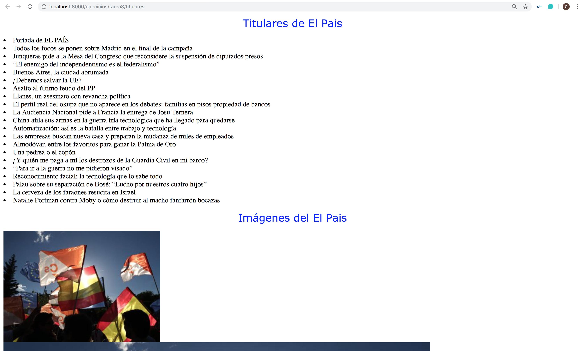

## Tarea 3: Expresiones Regulares

#### Ejercicio: Extraer los titulares y/o imágenes

Realizar un programa en el que se acceda a un periódico, en este caso a [El País](https://elpais.com), y se extraiga haciendo uso de expresiones regulares los titulares y las imágenes del mismo, en este caso se ha escogido la información de la portada (http://ep00.epimg.net/rss/elpais/portada.xml):

~~~python
# urls.py

# ninguna entrada
path('tarea3/titulares', views.extraer_titulares_imagenes),
~~~

~~~python
# views.py
def extraer_titulares_imagenes(request):

    '''
    Función que nos permite extraer los titulares e imágenes de un periódio,
    a partir del contenido XML
    '''

    contenido = ""
    titulos = []
    imagenes = []
    context = {}

    # La URL de la que vamos a extraer el contenido
    url = 'http://ep00.epimg.net/rss/elpais/portada.xml'

    # Comprobamos que la URL escogida devuele estatus 200
    web = requests.get(url)
    if(web.status_code == 200): contenido = web.text

    # La estructura de los títulos en la URL de XML
    extraer_titulares = re.findall(r'<title><\!\[CDATA\[(.+?)\]\]><\/title>',
                              contenido)

    # La estructura de los títulos en la URL de XML
    extraer_imagenes = re.findall(r'<enclosure url="(.+?)"', contenido)

    # Recorremos todos los de la página
    for titular in extraer_titulares:
        titulos.append({'titular': titular})

    for imagen in extraer_imagenes:

        imagenes.append({'imagen': imagen})

    # Los guardamos, para mostrarlos en la página HTML
    context = {
        'titulos': titulos,
        'imagenes': imagenes
    }

    return render(request, 'periodico.html', context)

~~~

El resultado de http://localhost:8000/ejercicios/tarea3/titulares es:

<!----

Un programa que analiza un archivo de texto, lo ideal es 1990. Sacar los de “1990”.

import re
match = re.search(r'([\w.-]+)@([\w.-]+)', str)

read // para leer línea a linea

Busca, pones paréntesis.
Buscas el patrón de “Popularity in 1990” los 4 digits de 1990, poner para que coja fechas
group

import re
m = re.search('(?P<dia>\d\d)-(?P<mes>\d\d)-(?P<año>\d\d)', texto)
                          # Si no tienen nombre sería
dia = m.group('dia')      # m.group(1)
mes = m.group('mes')      # m.group(2)
año = m.group('año')      # m.group(3)

En group.dia tiene el resultado de la abstracción

Leer los archivos, buscar patrones y que te devuelva los nombres.
Dada un archivo que están por año, devolver una lista

siempre vamos a trabajar con Python y HTML de forma separada, en donde en la carpeta template va a estar todo lo de HTML

Dos formas de hacer el ejercicio

1. Devolver los nombres más populares en un año (lista)
2. Django template —> Template Django buscar en google
    1. Creamos un directorio “template” con archivos HTML dentro de la carpeta ejercicios
    2. El archivo HTML que será el que saque
    3. Dentro nos creamos un archivo qu se llama “nombres.html”: ahi sacamos la pagina HTML. Esa es la manera de tener el HTML separado del código python. No mezclar código HTML con código Python.
    4. <html>
    5.
    6.   <head>
    7.       <title>Ejercicio de expresiones regulares</title>
    8.   </head>   
    9.
    10.   <body>
    11.     Estadísticas del año —> va en lengujae de plantilla que se llama (mostacho)
    12.   </body>   
    13. Estadísticas del año {{ año }} este año es una variable, puedes mandar una lista
3. Es
<html>

  <head>
      <title>Ejercicio de expresiones regulares</title>
  </head>

  <body>
    Estadísticas del año {{ año }}

    <table>
      <tr>
        <th> Nombre </th>
        <th> Número </th>
      </tr>

      
        <tr>
          <td> {{ l.nombre }} </td>
          <td> {{ l.numero }} </td>
        </tr>
      

    </table>

  </body>

</html>

Ahora me voy al views e importo pongo una  librería

from django.shortcuts import render

render(request, 'templates/nombres.html', <la variable que mandas>)

def ejercicio_expresiones_regulares(request, entrada):

    context = {
        'año': 1990,
        'lista': lista de objetos
          en lista cada elemento es un diccionario
          {'nombre': 'pepe', 'numero': 2},
                {'nombre': 'juan', 'numero': 28},
                // esta lista la hemos sacado de la BD
    }

    return render(request, 'templates/nombres.html', context)

Esta manera    se llama "jinja" (ya lo veremos más adelante)

tambien podemos hacer que devuelva "requets HTTP"

RSS : ver que es

http://ep00.epimg.net/rss/tags/ultimas_noticias.xml

view-source:http://ep00.epimg.net/rss/tags/ultimas_noticias.xml

Para coger este archivo, lo importamos con el requirements

r = requests.get('htpps://')

Importar "requests" en el requiriements

requests==2.21.0

Lo de los bebes ya no lo hacemos:

ponemos [url][imagen]

Sacamos todos los enlaces de una pagina web y ponemos

Vamos buscando estas cosas:

<image>
<url>
https://ep00.epimg.net/iconos/v1.x/v1.0/logos/cabecera_portada.png
</url>
<title>Logotipo de EL PAÍS</title>
<link>https://elpais.com/</link>
</image>

Y mostramos en la html final, por ejemplo las fotos, o los títulos

una ruta con titulares y otra con fotos

docker-compose build para instalar el del requiremets

hacer con la funcion de requests, por lo que hay que importar el archivo

obtener los titulares
<title><\[!CDATA\](.+?)\]\]<\/title>

<title><!\[CDATA\[(.+?)\]\]<\/title>

coger lo de view-source:web.xml

la semana que vienne vemos los ejercicios de la asignatura, para crear, leer, eliminar registros

---->
