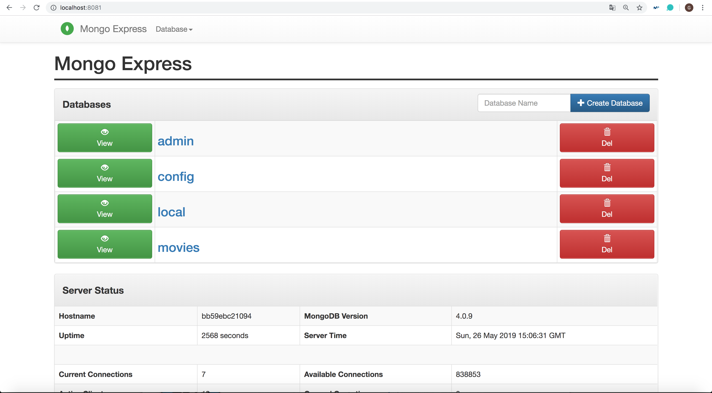
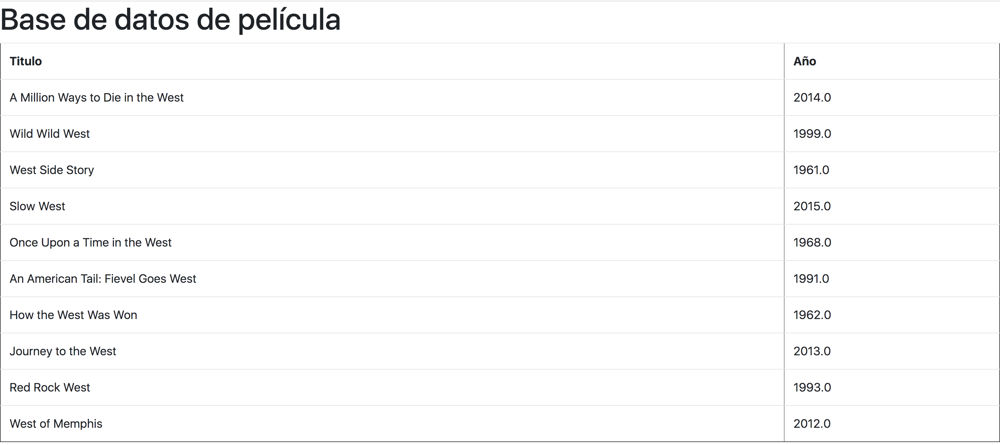
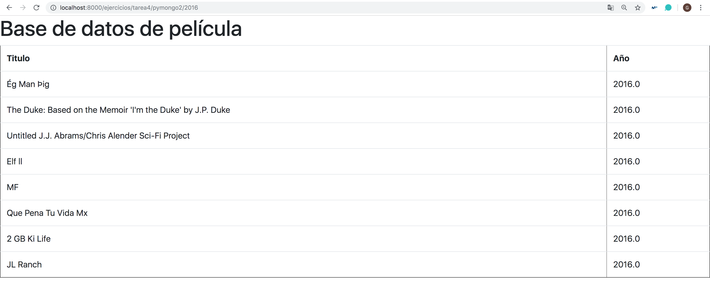
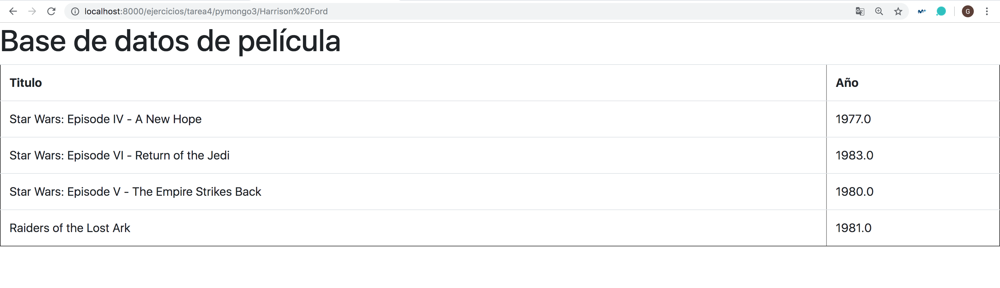
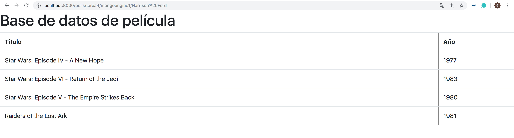

## Tarea 4: Base de Datos MongoDB

Antes de realizar las consultas, debemos instalar la base de datos NoSQL [MongoDB](https://docs.mongodb.com/manual/tutorial/getting-started/). Para ello debemos hacer los siguientes pasos:

1. Creamos el fichero `docker-compose.yml`
~~~
version: '3'
  services:
    mongo:
      image: mongo:4.0
      volumes:
        - ./datos_db:/data/db
        - .:/datos

    mongo-express:
      image: mongo-express
      ports:
        - 8081:8081
      depends_on:
        - mongo

    web:
      build: .
      command: python manage.py runserver 0.0.0.0:8000
      volumes:
        - .:/code
      ports:
        - 8000:8000
      links:
        - mongo
      depends_on:
        - mongo
~~~

2. Instalamos y descargamos el contenedor con `docker-compose build`

3. Arrancamos el contenedor con `docker-compose up`

4. Importamos el fichero JSON de las películas a la raíz: `docker-compose exec mongo mongoimport --db movies --collection pelis --file /datos/movieDetails.json`

5. Accedemos a http://localhost:8081

Con esto ya tenemos nuestra base de datos disponible, para comprobar que los contenedores están creados correctamente, hacemos `docker ps` y comprobamos que tenemos que los 3 contenedores del `docker-compose.yml`. Y para acceder al contenedor `docker-compose exec mongo /bin/bash`.

#### Consultas usando pymongo

La primera parte de la tarea es hacer una consulta a la base de datos, haciendo uso de `pymongo`.

**Ejercicio 1**

Mostrar las primeras 10 películas de la base de datos.

~~~python
# urls.py

# entrada del año de la película
path('tarea4/pymongo2/<entrada>', views.pymongo_url),
~~~

~~~python
# views.py

def pymongo_url(request, entrada):

    '''
    Mostrar las primeras películas a partir de la entrada de un año
    '''

    lista = []
    lista = pelis.find({ "year": int(entrada) })
    #print(pelis.count_documents({}))
    #print(lista)
    #for x in pelis.find({ "year": entrada }):
    #    lista.append(x)

    context =  {'lista': lista}

    return render(request, "salida.html", context)
~~~

El resultado de http://localhost:8000/ejercicios/tarea4/pymongo1 es:

**Ejercicio 2**

Mostrar las primeras películas de la base de datos de un año, para ello se debe de introducir en la URL el año que se desea consultar.

~~~python
# urls.py

# entrada del año de la película
path('tarea4/pymongo2/<entrada>', views.pymongo_year),
~~~

~~~python
# views.py

def pymongo_year(request, entrada):

    '''
    Mostrar las primeras películas a partir de la entrada de un año
    (haciendo uso de pymongo)
    '''

    lista = []
    lista = pelis.find({ "year": int(entrada) })
    #print(pelis.count_documents({}))
    #print(lista)
    #for x in pelis.find({ "year": entrada }):
    #    lista.append(x)

    context =  {'lista': lista}

    return render(request, "salida.html", context)
~~~

El resultado de http://localhost:8000/ejercicios/tarea4/pymongo2/2016 es:

**Ejercicio 3**

Mostrar las primeras películas de la base de datos de un año, para ello se debe de introducir en la URL el actor que se desea consultar.

~~~python
# urls.py

# entrada del actor de la película
path('tarea4/pymongo3/<entrada>', views.pymongo_actor),
~~~

~~~python
# views.py

def pymongo_actor(request, entrada):

    '''
    Mostrar las primeras películas a partir de la entrada de un actor
    (haciendo uso de mongoengine)
    '''

    lista = []
    lista = pelis.find({"actors": {"$regex": entrada}})

    context = {
      'lista': lista,
      'actor': True,
	}

	return render(request,"salida.html",context)
~~~

El resultado de http://localhost:8000/ejercicios/tarea4/pymongo3/Harrison%20Ford es:

#### Consultas usando mongoengine

Antes de hacer uso de `mongoengine`, deberemos importar dicho paquete en el fichero `requirements.txt`:

~~~
Django>=2.0,<3.0
requests==2.21.0
mongoengine==0.16
~~~

En nuestra aplicación definitiva usaremos `monogoengine`, que es un ORM muy inspirado en el model de Django. Para ello haremos una nueva aplicación en nuestro proyecto:

~~~
docker-compose run web python manage.py startapp pelis
~~~

Ese comando nos crea una carpeta **pelis** y copiamos en el archivo `models.py`:

~~~
from mongoengine import *

connect('movies', host='mongo')

class Pelis(Document):
	title     = StringField(required=True)
	year      = IntField(min_value=1900,max_value=2222)
	rated     = StringField()
	runtime   = IntField()
	countries = ListField(StringField())
	genres    = ListField(StringField())
	director  = StringField()
	writers	  = ListField(StringField())
	actors	  = ListField(StringField())
	plot	  = StringField()
	poster	  = StringField()
	imdb	  = DictField()
	tomato	  = DictField()
	metacritic= IntField()
	awards 	  = DictField()
	type 	  = StringField()
~~~

**Ejercicio**

En este ejercicio se debe de hacer la misma consulta realizada con pymongo, en este caso se ha escogido el **ejercicio 3**, el cual muestra las primeras películas de la base de datos de un año, para ello se debe de introducir en la URL el actor que se desea consultar.

~~~python
# pelis/urls.py

# entrada del actor de la película
path('tarea4/mongoengine1/<entrada>', views.mongoengine_year),
~~~

~~~python
# pelis/views.py

def mongoengine_year(request, entrada):

    '''
    Mostrar las primeras películas a partir de la entrada de un actor
	(haciendo uso de mongoengine)
	'''
	regex = re.compile(entrada)
	pelis = Pelis.objects(actors = regex)

	context = {
		'lista': pelis,
		'entrada': True,
	}

  return render(request, "salida.html", context)
~~~

El resultado de http://localhost:8000/ejercicios/tarea4/pymongo3/Harrison%20Ford es:

