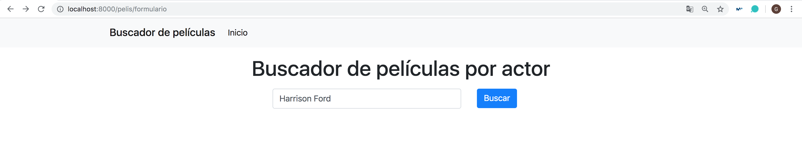

## Tarea 5: CSS Frameworks y formularios

A partir de lo visto en la [Tarea 4](https://github.com/Gecofer/MII_SSBW_1819/blob/master/Tarea%204/Tarea4.md) vamos añadir a las consultas realizadas con `mongonengine` una consulta del tipo http://localhost:8000/ejercicios/pelis%20que%20sale/Clark%20Gable, haciendo uso de un formulario.

~~~python
# urls.py

# entrada del actor de la película
path('pelis_que_sale/<entrada>', views.pelis_que_sale, name="pelis_que_sale"),

# ninguna entrada
path('formulario', views.formulario, name= "formulario"),

# ninguna entrada
path('peliculas_actor', views.peliculas_actor),
~~~

~~~python
def pelis_que_sale(request, entrada):

	'''
	Mostrar las primeras películas a partir de la entrada de un actor
	(haciendo uso de mongoengine)
	'''
	regex = re.compile(entrada)
	pelis = Pelis.objects(actors = regex)

	context = {
		'lista': pelis,
		'entrada': True,
	}

	return render(request, "salida.html", context)

# ------------------------------------------------------------------------------

def formulario(request):

	'''
	Página que muestra el formulario para introducir el actor
	'''

	return render(request,"formulario1.html")

# ------------------------------------------------------------------------------

def peliculas_actor(request):

	'''
	Obtenemos las películas en donde dicho actor es protagonista
	'''

	actor = request.POST.get('actor')

	return HttpResponseRedirect(reverse('pelis_que_sale',args=[actor]))
~~~

La primera página que visualizamos es el formulario (http://localhost:8000/pelis/formulario):

En dicha página escribimos el actor a buscar, en este caso he puesto "Harrison Ford", lo cual nos redirige a la siguiente página (http://localhost:8000/pelis/pelis_que_sale/Harrison%20Ford):

