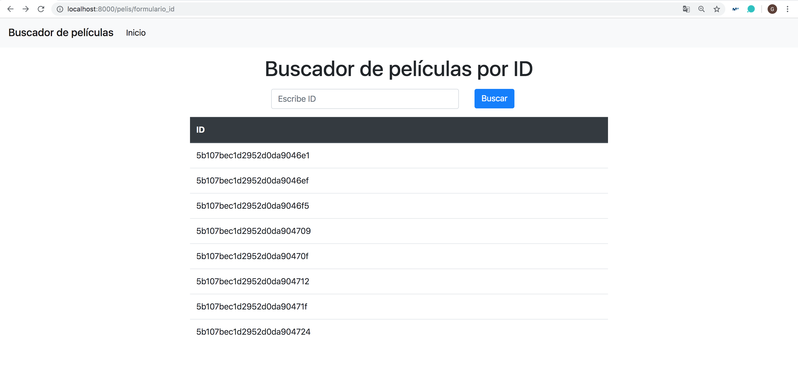

## Tarea 6: CSS

En esta tarea, nos hemos centrado en mostrar información de la película, a través de su identificador. Para ello, a partir de un formulario, se introducirá el ID de la película, el cual nos redigirá a una pantalla con información sobre la película: actores, directores, sinopsis... La página creada para mostrar información sobre la película estará creada con CSS.

~~~python
# pelis/urls.py

# ninguna entrada
path('formulario_id', views.formulario_id, name= "formulario_id"),

# ninguna entrada
path('peliculas_id', views.peliculas_id),

# entrada el ID de la película
path('informacion_pelicula/<id>', views.informacion_pelicula, name="informacion_pelicula"),

~~~

~~~python
# pelis/views.py

def informacion_pelicula(request, id):

	'''
	Se muestra información relevante de la película a partir de su ID
	'''
	# Buscamos la película solo por el ID
	pelicula = Pelis.objects(id=id)

	context = {
		'pelicula': pelicula[0],
		'id': True,
	}

	return render(request,"informacion_pelis.html",context)

# ------------------------------------------------------------------------------

def formulario_id(request):

	'''
	Página que muestra el formulario para introducir el id
	'''

	return render(request,"id.html")

# ------------------------------------------------------------------------------

def peliculas_id(request):

	'''
	Obtenemos la películas de dicho ID
	'''

	id = request.POST.get('id')

	return HttpResponseRedirect(reverse('informacion_pelicula',args=[id]))
~~~

La primera página que visualizamos es el formulario (http://localhost:8000/pelis/formulario_id):

En dicha página escribimos el ID a buscar (se muestran algunos debajo), en este caso he puesto "5b107bec1d2952d0da9046e1", lo cual nos redirige a la siguiente página (http://localhost:8000/pelis/informacion_pelicula/5b107bec1d2952d0da9046e1):

