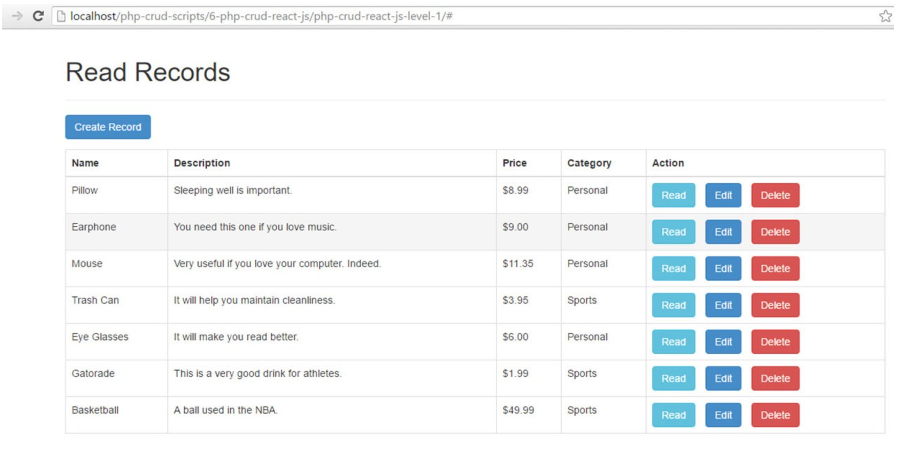

## Tarea 7: CRUD

> **Pincha [aquí](https://github.com/Gecofer/MII_SSBW_1819/blob/master/Tarea%207/Tarea7.md) para ver cómo se hizo la Tarea 7**

Es esta tarea haremos las pantallas para el resto del CRUD de la aplicación, usando la clase [forms](https://docs.djangoproject.com/en/2.1/topics/forms/) de Django. Aquí hay un [ejemplo](https://medium.com/@siddharthshringi/how-i-made-my-first-django-app-4ede65c9b17f).

Sugerencia: Usar [django-mongoengine-forms](https://pypi.org/project/django-mongoengine-forms/) para conenctar directamente con la BD.
