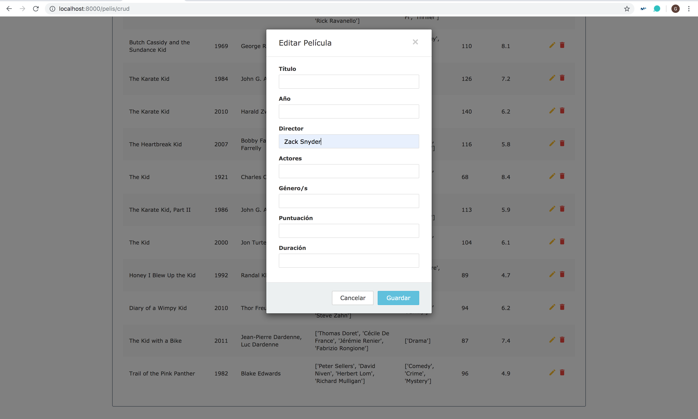

## Tarea 7: CRUD

En esta tarea se van a añadir las funcionalidades para añadir, borrar y modificar películas de la base de datos. Para realizar esta tarea se han seguido los tutoriales:

- https://docs.djangoproject.com/en/2.1/topics/forms/
- https://medium.com/@siddharthshringi/how-i-made-my-first-django-app-4ede65c9b17f
- https://pypi.org/project/django-mongoengine-forms/

Lo primero que hemos hecho, ha sido añadir un acceso a esta tarea (CRUD) en la página de inicio realizada para alguna de las anteriores tareas:

A continuación, se ha creado la página principal que permite visualizar las películas ordenadas según actor, editarlas, eliminarlas y añadir nuevas películas. Para crear la página se ha hecho uso de la [siguiente vista](https://www.tutorialrepublic.com/snippets/preview.php?topic=bootstrap&file=crud-data-table-for-database-with-modal-form). Por lo que para acceder simplemente hace falta poner en el navegador la URL http://localhost:8000/pelis/crud:

~~~python
# pelis/urls.py

# ninguna entrada
path('crud', views.crud, name="crud"),

# ninguna entrada
path('crear_pelicula', views.crear_pelicula),

# entrada el ID de la película
path('editar_pelicula/<id>', views.editar_pelicula),

# entrada el ID de la película
path('borrar_pelicula/<id>', views.borrar_pelicula),
~~~

### Añadir - POST

Para añadir una película se debe de pulsar el botón verde que pone "Añadir película" arriba del todo.

~~~python
# pelis/views.py

def crear_pelicula(request):

	'''
	Función que permite crearnos una película, a partir de los campos:
	titulo, año, director, actores, genero, puntuacion, duracion
	'''

	# Para crear una película se debe de hacer uso del método POST
	if(request.method == "POST"):
		parametros = request.POST
		actores = parametros['actores'].split(", ")
		genero = parametros['genero'].split(", ")

		# Creamos la película
		pelicula = Pelis(title = parametros['titulo'],
						 year = parametros['año'],
						 director = parametros['director'],
						 actors = actores,
						 genres = genero,
						 imdb = {'rating' : parametros['puntuacion']},
						 runtime = parametros['duracion'])

		# Guardamos la pelicula
		pelicula.save()

	return HttpResponseRedirect(reverse('crud'))
~~~

A continuación, vemos el proceso para el mismo:

### Modificar - PUT

Para modificar una película se debe de pulsar el icono del lápiz amarillo que hay asociado a cada película:

~~~python
# pelis/views.py

def editar_pelicula(request,id):

	'''
	Función que permite editar una película a partir de su identificador, y
	los campos: titulo, año, director, actores, genero, puntuacion, duracion
	'''
	pelicula = Pelis.objects(id=id)

	# Se da la opción de que el usuario cambie solo datos concretos
	if(request.method == "POST"):
		parametros = request.POST

		if(parametros.get('titulo')!= ''):
			pelicula.update_one(title=parametros.get('titulo'))

		if (parametros.get('año') != ''):
			pelicula.update_one(year=parametros.get('año'))

		if (parametros.get('director') != ''):
			pelicula.update_one(director=parametros.get('director'))

		if (parametros.get('actores') != ''):
			actores = parametros.get('actores').split(", ")
			pelicula.update_one(actors=actores)

		if (parametros.get('genero') != ''):
			genero = parametros.get('genero').split(", ")
			pelicula.update_one(actors=genero)

		if (parametros.get('puntuacion') != ''):
			pelicula.update_one(imdb__rating=parametros.get('puntuacion'))

		if (parametros.get('duracion') != ''):
			pelicula.update_one(runtime=parametros.get('duracion'))

	return HttpResponseRedirect(reverse('crud'))
~~~

A continuación, vemos el proceso para el mismo. En este caso se ha considerado solo modificar el director de la película:

### Borrar - DELETE

Para borrar una película se debe de pulsar el cubo de basura rojo que aparece para dicha película.

~~~python
# pelis/views.py

def borrar_pelicula(request,id):

	'''
	Función que permite borrar una película, a partir de su identificador
	'''

	pelicula = Pelis.objects(id=id)

	if(pelicula.count()==1):
		pelicula.delete()

	return HttpResponseRedirect(reverse('crud'))
~~~

A continuación, vemos el proceso para el mismo:

