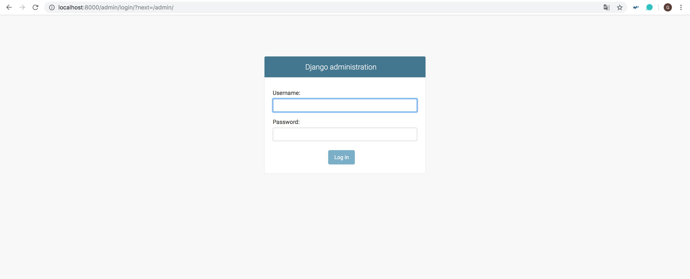

## Tarea 8: Autentificación, Autorización, y Registro de eventos

Django tiene todo lo necesario para el autentificar usuarios, modelo en la BD, formularios, etc. Pero hay un plugin para Django que facilita todo esto: **django-allauth** (https://github.com/pennersr/django-allauth), que incluye también plantillas, el registro en uno o dos pasos (con activación de la cuenta por e-mail), gestión de la contraseña olividada con tokens, y delegacion de la autentificación en redes sociales usando oauth2. Pero no incluye Bootstrap, por lo que debemos ponerlo en Bootstrap.

En el fichero **settings.py** añadimos;

~~~
TEMPLATES = [
    {
        'BACKEND': 'django.template.backends.django.DjangoTemplates',
        'DIRS': [],
        'APP_DIRS': True,
        'OPTIONS': {
            'context_processors': [
                'django.template.context_processors.debug',
                'django.template.context_processors.request',
                'django.contrib.auth.context_processors.auth',
                'django.contrib.messages.context_processors.messages',
            ],
        },
    },
]
~~~

### HTTPS

Por tanto, es necesario añadir un nuevo servicio al **docker-compose.yml**:

~~~
version: '3'
  services:
  nginx:
    image: nginx:alpine
    ports:
      - "80:80"
      - "443:443"
    volumes:
      - ./conf:/etc/nginx/conf.d:ro
      - ./cert:/etc/ssl/private:ro
    depends_on:
	     - web
       ...
    web:
      build: .
      command: python3 manage.py runserver 0.0.0.0:8000
      volumes:
        - .:/code
~~~

Con esto lo que se pretende es que no poner el puerto el 8000 (http://localhost:8000/pelis/buscador) cada vez que nos conectemos, simplemente poniendo https://localhost/pelis/buscador entra directamente porque estamos desde NGIX.

Entonces, como acabamos de ver, ahora lo de los puertos no hace falta, ya que accede a través del puerto 80 (http://localhost:80/pelis/buscador), y también desde el 443 como se puede ver en el **docker_compose.yml** (http://localhost:443/pelis/buscador)

Como acabamos de ver ese es el resultado que vamos a obtener, pero para ello, es necesario realizar unos cuantos pasos antes:

1. Nos creamo un directorio que se llame **cert**, en donde pondremos un par de archivos con una pareja de claves generadas para este próposito. Para generar la clave privada y pública en mac, se ha seguido el siguiente [tutorial](https://nickolaskraus.org/articles/how-to-create-a-self-signed-certificate-for-nginx-on-macos/):

  ~~~
  # Para crear las claves

  mkdir -p /usr/local/etc/ssl/private
  mkdir -p /usr/local/etc/ssl/certs

  sudo openssl req -x509 -nodes -days 365 -newkey rsa:2048 -keyout /usr/local/etc/ssl/private/nginx-selfsigned.key -out /usr/local/etc/ssl/certs/nginx-selfsigned.crt
  ~~~

  - `ssl_certificate /etc/ssl/private/nginx.crt;` En **nginx.key** está la clave privada.
  - `ssl_certificate_key /etc/ssl/private/nginx.key;` En **nginx.crt** está la clave pública.

2. Y en el directorio **conf** el archivo de configuración de nginx:

  ~~~
  server {
    listen 80 default_server;
    server_name _;

    # redirecciona todo a https
    return 301 https://$host$request_uri;
  }

  server {
    listen 443 ssl;
    server_name _;

    # la pareja de claves
    ssl_certificate /etc/ssl/private/nginx.crt;
    ssl_certificate_key /etc/ssl/private/nginx.key;
    keepalive_timeout   70;

    ssl_protocols       TLSv1 TLSv1.1 TLSv1.2;
    ssl_ciphers         AES128-SHA:AES256-SHA:RC4-SHA:DES-CBC3-SHA:RC4-MD5;
    ssl_session_cache   shared:SSL:10m;
    ssl_session_timeout 10m;

    location  ~ ^/(miapp|admin|accounts|ejercicios|pelis|static) {
      try_files $uri @proxy_to_app;
    }

    # proxy inverso
    location @proxy_to_app {
    proxy_set_header X-Forwarded-For $proxy_add_x_forwarded_for;
    proxy_set_header Host $http_host;
    proxy_redirect off;
    proxy_pass   http://web:8000;
    }
  }
  ~~~

### Django allouth

Vamos a instalar **django-allauth** (https://django-allauth.readthedocs.io/en/latest/installation.html), para ello ponemos en el **requirements.txt**: `django-allauth==0.39.1`

En el fichero **settings.py** añadimos;

~~~
TEMPLATES = [
    {
        'BACKEND': 'django.template.backends.django.DjangoTemplates',
        'DIRS': [],
        'APP_DIRS': True,
        'OPTIONS': {
            'context_processors': [
                'django.template.context_processors.debug',
                'django.template.context_processors.request',
                'django.contrib.auth.context_processors.auth',
                'django.contrib.messages.context_processors.messages',
            ],
        },
    },
]
~~~

Y añadimos en el mismo archivo:

~~~
AUTHENTICATION_BACKENDS = (
  ...
  # Needed to login by username in Django admin, regardless of `allauth`
  'django.contrib.auth.backends.ModelBackend',

  # `allauth` specific authentication methods, such as login by e-mail
  'allauth.account.auth_backends.AuthenticationBackend',
  ...
)
~~~

Y en `INSTALLED_APPS` añadimos:

~~~
INSTALLED_APPS = [
  ...

  'django.contrib.sites',
  'allauth',
  'allauth.account',
  'allauth.socialaccount',
]
~~~

Podemos poner el de Twitter o el de Github para acceder. Con esto lo que queremos hacer es hacer uso de dos bases de datos una para usuarios y otra para pelis.

Entonces, ahora mismo tenemos _ejercicios_ y _pelis_, nos falta _account_. Así que nos dirigimos al fichero **composeexample > urls.py** y ponemos:

~~~
urlpatterns = [
    path('admin/', admin.site.urls),
    url('ejercicios/',include('ejercicios.urls')),
    url('pelis/',include('pelis.urls')),

    # Añadimos
    path('accounts/', include('allauth.urls')),
]

~~~

Además, tenemos que tener en cuenta que cada vez que hagamos un cambio en SQLite, tenemos que hacer `docker-compose run web python manage.py migrate`.

Ahora hacemos `git clone de https://github.com/pennersr/django-allauth` y nos quedamos con la carpeta de templates en accounts. A continuación, accedemos a https://localhost/accounts/login/, lo que nos aparecerá una página de login:

Sin embargo, como no tenemos cuenta aún es necesario registrarse antes de iniciar sesión:

- user: gema
- pass: gema1995

Y hemos puesto que al hacer login, se nos redirija a la página principal del CRUD, con lo que la nueva URL sería http://localhost/accounts/login/pelis/crud:

Sin embargo, nuestro objetivo es hacer que para determinadas acciones en el sistema como añadir películas o eliminarlas sea necesario autenticarse. Para ello es necesario poner `@login_required`, con lo que hace falta añadir un import a **views.py**

~~~python
from django.contrib.auth.decorators import login_required

...

@login_required
def my_view(request):
    ...
~~~

Y para cerrar sesión poner https://localhost/accounts/logout/:

Con esto lo que acabamos de hacer es que cuando realizamos alguna determinada acción, sea necesario autenticarse, se ha añadido autenticación a:

- Ver información de la película a través de su ID.
- Acceder a la página del CRUD.
- Cuando se quiera eliminar una película a la base de datos.
- Cuando se quiera añadir una película a la base de datos.

#### Ejemplo de autenticación para ver la información de una película a través de su ID

~~~python
# pelis/views.py

@login_required
def informacion_pelicula(request, id):

	'''
	Se muestra información relevante de la película a partir de su ID
	'''
	# Buscamos la película solo por el ID
	pelicula = Pelis.objects(id=id)

	context = {
		'pelicula': pelicula[0],
		'id': True,
	}

	return render(request,"informacion_pelis.html",context)
~~~

### Registro de eventos

Para el registro de eventos no hace falta instalar nada, simplemente para el log hacemos un `import logging` en **views.py** (https://docs.djangoproject.com/en/2.2/topics/logging/). Y con eso nos mostrará por pantalla los _loggings_.

Ponemos y pegamos en **settings.py**:

~~~
LOG_FILE = 'mi_archivo_de.log'

LOGGING = {
	 'version': 1,
	 'disable_existing_loggers': False,

	  'formatters': {
	       'verbose': {
             'format' : "[%(asctime)s] %(levelname)s [%(name)s:%(lineno)s] %(message)s",
              'datefmt' : "%d/%b/%Y %H:%M:%S"
	        },
           'simple': {
             'format': '%(levelname)s [%(name)s:%(lineno)s] %(message)s'
	           },
	       },

	       'handlers': {
	           'file': {
	               'level': 'INFO',
	               'class': 'logging.FileHandler',
	               'filename': os.path.join(BASE_DIR, LOG_FILE),
	               'formatter': 'verbose',
	               'mode':'w'
	            },
	            'console': {
	                'level': 'DEBUG',
	                'class': 'logging.StreamHandler',
	                'formatter': 'simple'
	            }
	        },

	        'loggers': {
	            'django': {
	                'handlers':['file'],
	                'propagate': True,
	                'level':'ERROR',
	             },
	             'mi_instagram': {
	                'handlers': ['file', 'console'],
	                 'level': 'DEBUG',
	              },
                'pelis': {
                    'handlers': ['file', 'console'],
                    'level': 'DEBUG',
                },     
	          }
	     }

~~~

Y para usarlo, simplemente tenemos que añadir a nuestras funciones, algunas de las funciones de logger que hay:

- logger.debug()
- logger.info()
- logger.warning()
- logger.error()
- logger.critical()

Por ejemplo, veamos un ejemplo para acceder a la página de inicio del buscador de películas:

~~~python
# pelis/views.py

import logging
logger = logging.getLogger(__name__)

def buscador(request):

	'''
	Página que muestra el formulario para introducir el actor
	'''

	logger.debug("Accediendo al buscador de películas")

	return render(request,"mainBuscador.html")
~~~

### Django admin

Necesitamos configurar la parte administrativa de nuestro proyecto Django. Crea un nuevo superusuario para que podamos iniciar sesión.

~~~
$ docker-compose run web python manage.py createsuperuser
~~~

Ahora podemos iniciar el servidor de nuevo con `python manage.py runserver` y luego navegar a la página de administración http://localhost:8000/admin. Y utilizamos nuestras credenciales de superusuario recién creadas para iniciar sesión.

- user: root
- pass: admin

