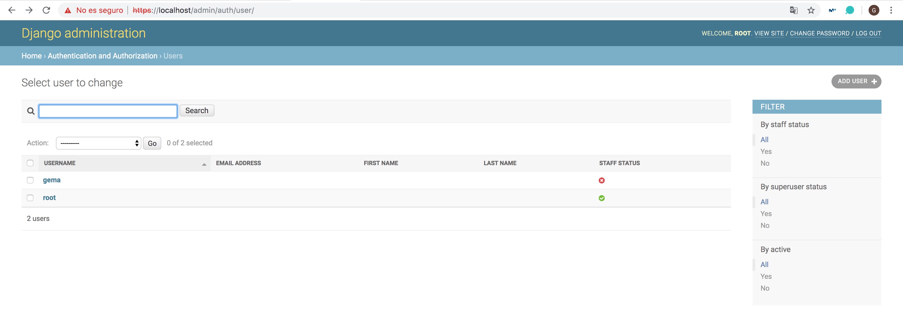
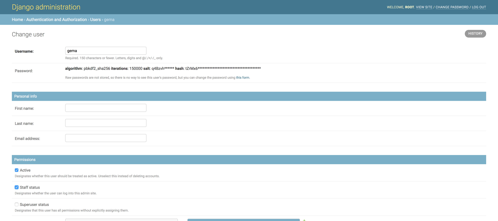
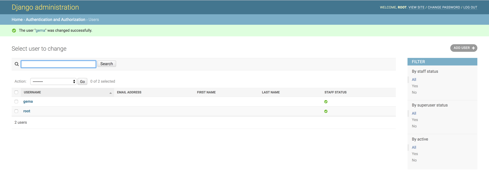

## Tarea 9: Autorización CRUD

La tarea 9 se ha realizado de forma complementaria junto con la [tarea 8](https://github.com/Gecofer/MII_SSBW_1819/blob/master/Tarea%208/Tarea8.md), ya que en dicha tarea se le ha añadido al CRUD autorización, de manera que solo los usuarios que sean 'staff' puedan añadir o borrar registos.

