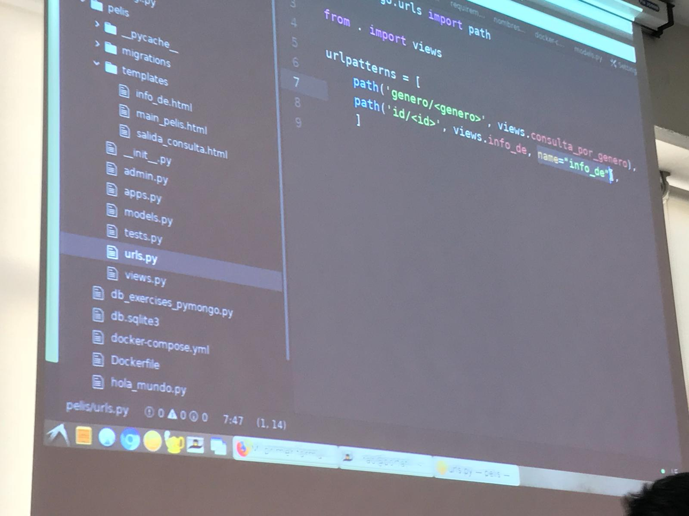
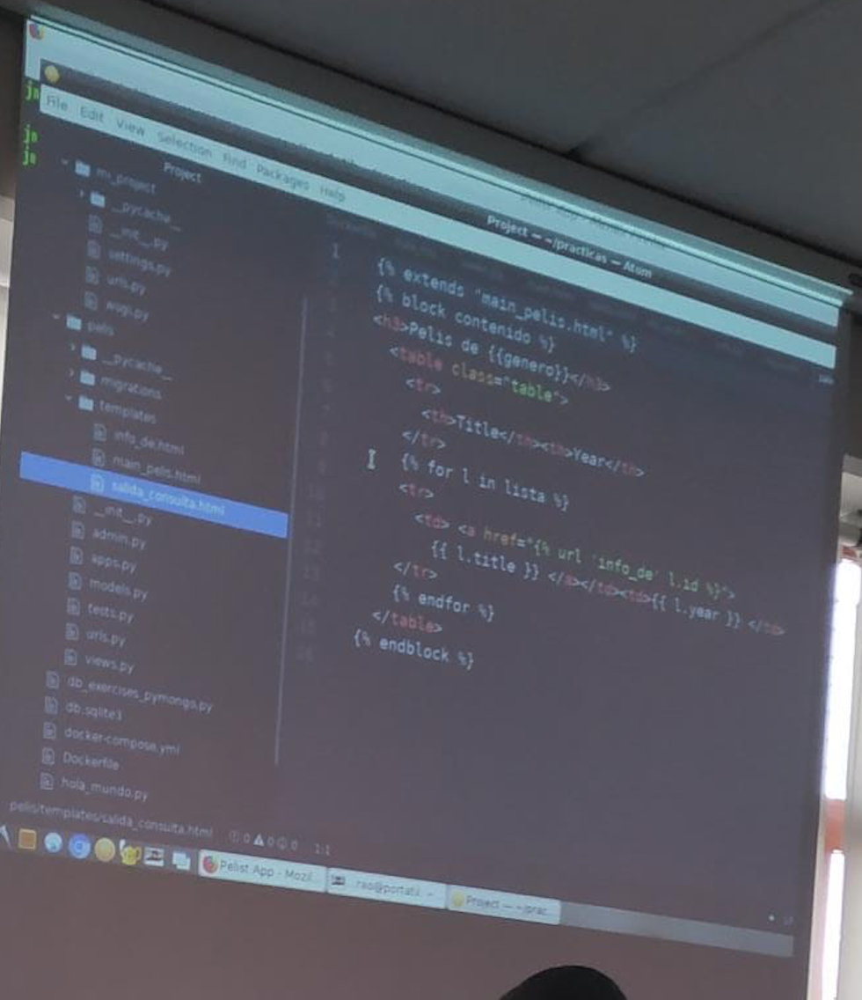
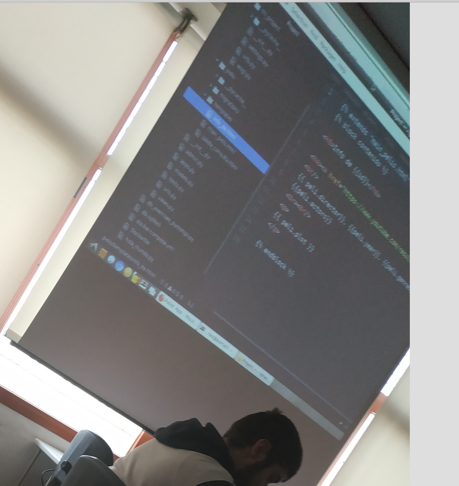
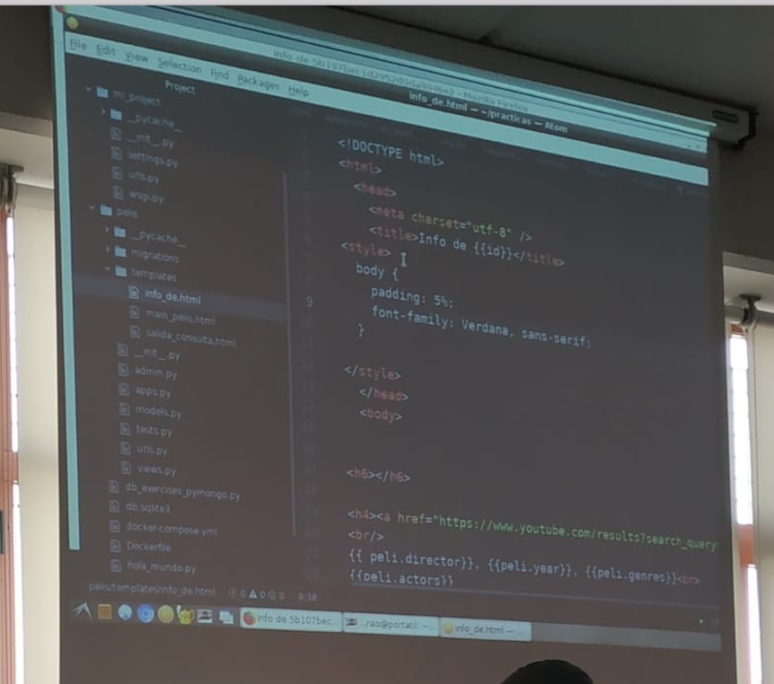

# Tarea 6

localhost:8000/pelis/genero/Comedy

y dentro tiene las peliculas y si cliclas en ellas la direccion URL

path = ('generos/<genero>', views.consulta_por_genero)
path = ('id/<id>'', views.info

----

en salida_consulta.html

< href = "">

Busca la URL de info_de
----

views.py

def info_de(rques, ide):
  context = {'id' : id,
  'peli': Pelis.objects().get(id=id)}

  return render(request, "info_html", context)

def consulta_porgeneros(rquest, generos)

----

info_de_html

---

Para la tarea 6, tenemos que hacer uso de CSS:

https://www.w3schools.com/css/

~~~
body {
  background-color: lightblue;
}

h1 {
  color: white;
  text-align: center;
}

p {
  font-family: verdana;
  font-size: 20px;
}
~~~

https://www.w3schools.com/css/css_syntax.asp

Hay tres tipos de selectores, o bien este que se aplica a todos lo tipos de elementos.

El atributo id, sirve para identtificar un unico identificador, y te refieres con la almohadilla.

Ya la ultima probabilidad que hay, es el de clase, lo de
.center, es que cuando quieres aplicar a varias. Boostrap es una colección ya de esto hecho.

Hemos visto tres selectores:
- el que es para elementos: nombre del elementos
- el que es para uno solo, que es el id (id)
- el que es con un punto, que es para las clases (clase)

----

https://www.w3schools.com/css/css_font.asp

Para tipo de letra, hay dos solo

Nos dice, que sino hay una fuente, coge la otra, ya que todos los ordenadores no tienen las mismas fuentes. Pero también, podemos descargarnos la fuente, por ejemplo como en Google.
~~~
p {
  font-family: "Times New Roman", Times, serif;
}
~~~

EStilo: italica...

Tamaño

o eliges pixel
~~~
h1 {
  font-size: 40px;
}

h2 {
  font-size: 30px;
}

p {
  font-size: 14px;
}
~~~

o em: el tamaño de una em

~~~
h1 {
  font-size: 2.5em; /* 40px/16=2.5em */
}

h2 {
  font-size: 1.875em; /* 30px/16=1.875em */
}

p {
  font-size: 0.875em; /* 14px/16=0.875em */
}
~~~

o el % (lo aconseja)

son rspecto al tamaño original
~~~
body {
  font-size: 100%;
}
~~~

o este que es nuevo

respecto al tamaño de la ventana

~~~
<h1 style="font-size:10vw">Hello World</h1>
~~~

----

https://www.w3schools.com/css/css_colors.asp

Para los colores, lo ponemos como FFFFF...

----

https://www.w3schools.com/css/css_boxmodel.asp

Hay 4 unidades de cada una, esto es lo que se llama el modelo de caja

https://www.w3schools.com/css/tryit.asp?filename=trycss_boxmodel

- el width: 30%; es para todo, te dice el 30% de la pantalla
- margin: 25px;--> ponemos que el margen para ambos es de 25, es el margen de fuera

~~~

~~~

border-top: 25px solid red;: y border-top para poner un borde en algun lado.

---

https://www.w3schools.com/css/css_positioning.asp

Position

en info_de.html

<!DOCTYPE>
<html>
  <head>
  <meta charset = "utf-8">
  <title= info de >

  padding =

---

Crear el formulario

# Esto sería el formulario

~~~
<form action = "busqueda" method = "get">
  Buscar por:
  <input name = 'titulo'
          place_holder= 'titulo de la peli'
          type = 'text'>
    <input type = 'submit' value >

</form>

def ----(request):
  ----- request.GET.get('titulo') o request.GET['titulo']
      y pondriamos el name de antes ahí, titulo en este caso.
~~~

https://developer.mozilla.org/es/docs/Learn/HTML/Forms/Your_first_HTML_form

~~~
<form action="/my-handling-form-page" method="post">

</form>
~~~

Solo vamos hacer consultar, por eso hacemos uso de GEt y no POST

El Boostrap tiene para crear formularios más facil.

Lo podemos hacer con CSS "Háamoslo un poco más lindo con CSS": https://developer.mozilla.org/es/docs/Learn/HTML/Forms/Your_first_HTML_form

---

**Para la tarea 6, el formulario con Bootsrap y todo lo demás con CSS**

Podemos meter la imagen de la pelicula, el poster...

----

Esto es para que funcione el campo de la BD de poster, pero es porque han cambiado de servidor. Así que hay que poner este servidor:

m.media-amazon.com

- la historieta de que va
- resumen de la historia

Tarea 6: todo el Bootsrap, menos la información que mostramos de la película que es en CSS, la tabla que tenemos puede estar en Bootstrap.
