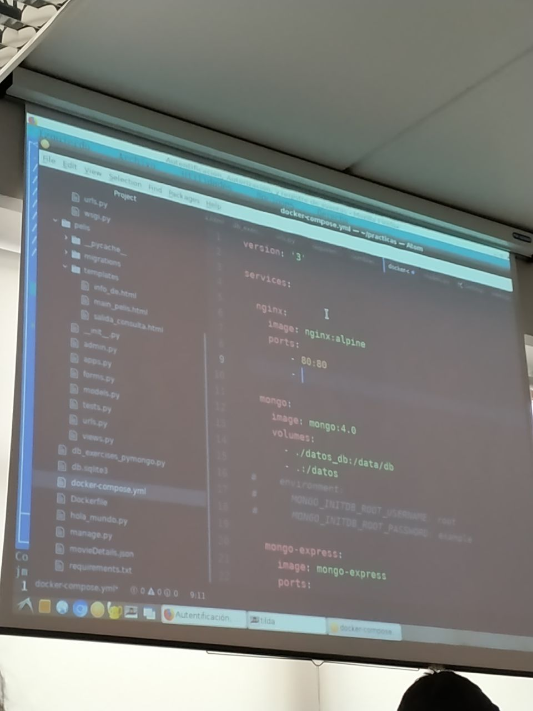
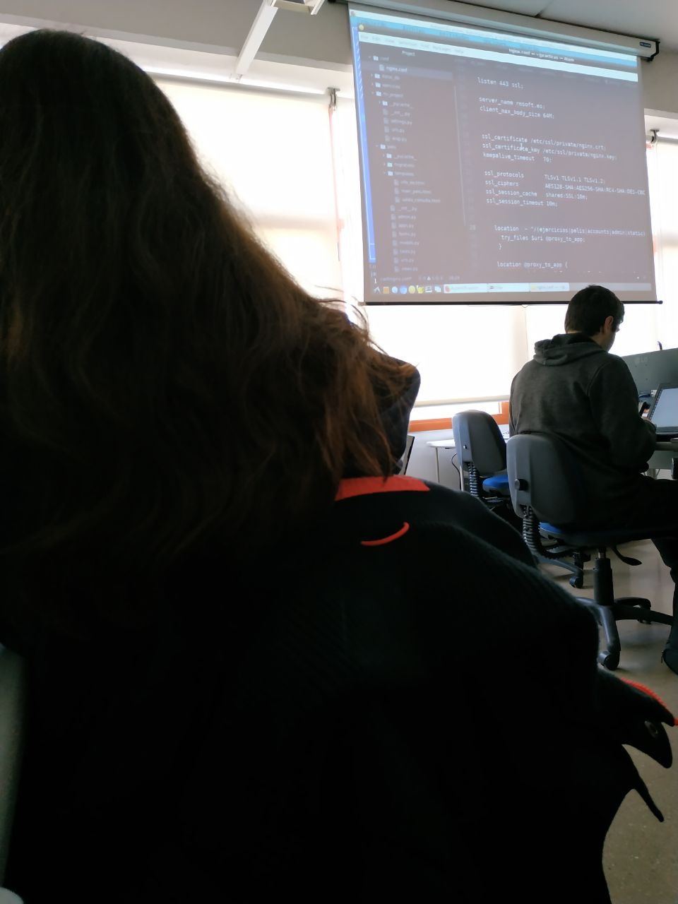
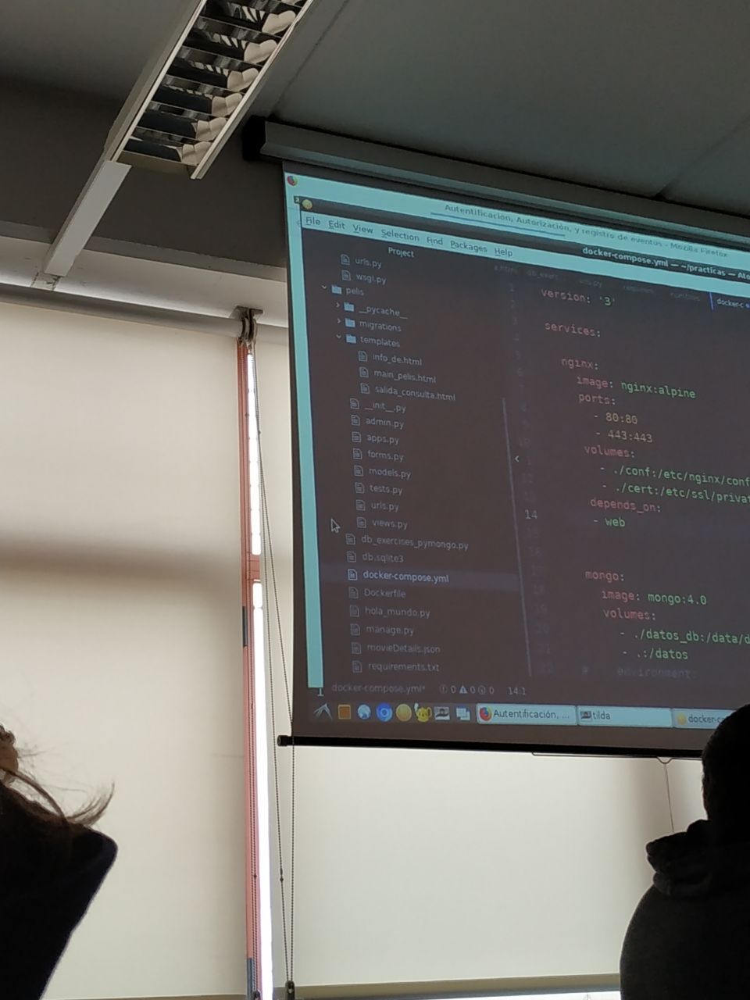
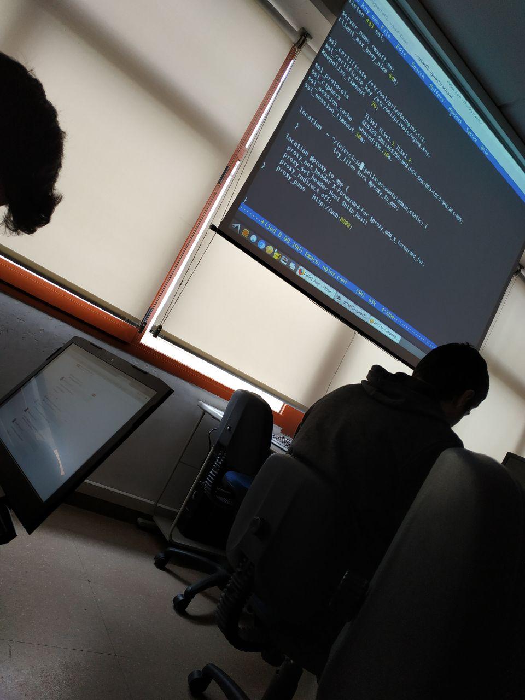
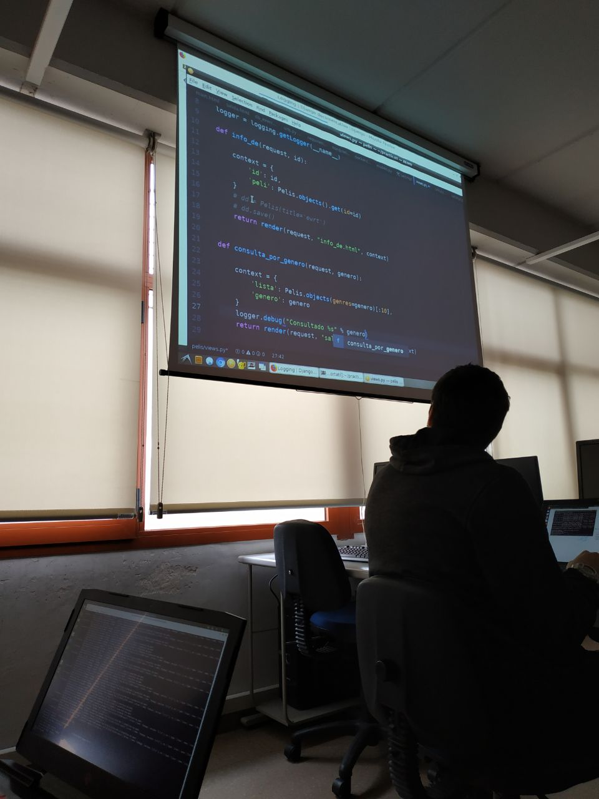

Tarea 8

---

No hace falta instalar nada

## Autentificación, Autorización, y registro de eventos

El Django allouth no tiene Bootstrap (ponerlo en Bootstrap)
https://github.com/pennersr/django-allauth

En la carpeta

Podemos personalizar los templates, usando los que tiene en templates y poniendolos en una carpeta templates/accounts.

es donde busca los TEMPLATES: TENER CUIDADO CON LOS TEMPLATES

~~~
TEMPLATES = [
    {
        'BACKEND': 'django.template.backends.django.DjangoTemplates',
        'DIRS': [],
        'APP_DIRS': True,
        'OPTIONS': {
            'context_processors': [
                'django.template.context_processors.debug',
                'django.template.context_processors.request',
                'django.contrib.auth.context_processors.auth',
                'django.contrib.messages.context_processors.messages',
            ],
        },
    },
]
~~~

EN LOS TEMPLATES puedes poner user-name, user authentificate

No tenemos que hacer lo del principio (https://docs.djangoproject.com/en/2.2/topics/auth/default/), ya lo hace Django solo.

- Authentication in Web requests: si queremos autentificarnos

~~~
if request.user.is_authenticated:
    # Do something for authenticated users.
    ...
else:
    # Do something for anonymous users.
    ...
~~~

- How to log a user in: esto esta hecho ya

- The login_required decorator: para saber que funciones tienen acceso a la autentificación, poner "@login_required"

from django.contrib.auth.decorators import login_required

@login_required
def my_view(request):
    ...

- Ejemplo de HTML:

~~~






Your username and password didn't match. Please try again.




    
    
Your account doesn't have access to this page. To proceed,
    please login with an account that has access.

    
    
Please login to see this page.

    


<form method="post" action="">

<table>
<tr>
    <td>{{ form.username.label_tag }}</td>
    <td>{{ form.username }}</td>
</tr>
<tr>
    <td>{{ form.password.label_tag }}</td>
    <td>{{ form.password }}</td>
</tr>
</table>

<input type="submit" value="login">
<input type="hidden" name="next" value="{{ next }}">
</form>

{# Assumes you setup the password_reset view in your URLconf #}

<a href="">Lost password?</a>

    
~~~

---

Este detallito es necesario para el despliegue, siempre que se usen contraseñas es necesario usar HTTPS, para su cifrado.

Añadir nuevo serviciod al docker-compose.yml:

~~~

nginx:
	  	  image: nginx:alpine
		  ports:
		  	- "80:80"
			- "443:443"
		  volumes:
		  	- ./conf:/etc/nginx/conf.d:ro
			- ./cert:/etc/ssl/private:ro
		  depends_on:
		    - web
~~~

_Docker compose se añade lo de nginx_

Y el puerto 8000 no hace falta ponerlo, entra internamente y ya estamos desde nginx

web:
  build: .
  command: python manage.py runserver 0.0.0.0:8000
  volumes:
    - .:/code
  #ports:
  #  - 8000:8000
  links:
    - mongo
  depends_on:
    - mongo

_Ahora lo del puerto 80 de la web no hace falta_

_Ponemos los puertos, además ahí ponemos el 443 también_

En el directorio cert, pondremos un par de archivos con una pareja de claves generadas a este próposito, y en el directorio conf el archivo de configuración de nginx:

clave publica - clave privada

~~~
server {
  listen 80 default_server;
  server_name _;

  # redirecciona todo a https
  return 301 https://$host$request_uri;
}

server {
  listen 443 ssl;
  server_name _;

  # la pareja de claves
  ssl_certificate /etc/ssl/private/nginx.crt;
  ssl_certificate_key /etc/ssl/private/nginx.key;
  keepalive_timeout   70;

  ssl_protocols       TLSv1 TLSv1.1 TLSv1.2;
  ssl_ciphers         AES128-SHA:AES256-SHA:RC4-SHA:DES-CBC3-SHA:RC4-MD5;
  ssl_session_cache   shared:SSL:10m;
  ssl_session_timeout 10m;

  location  ~ ^/(miapp|admin|accuonts) {
		try_files $uri @proxy_to_app;
  }

  # proxy inverso
  location @proxy_to_app {
	proxy_set_header X-Forwarded-For $proxy_add_x_forwarded_for;
	proxy_set_header Host $http_host;
	proxy_redirect off;
	proxy_pass   http://web:8000;
  }
~~~

_Fichero de configuración nginx.conf copia y pega_

y hay que poner en location:

~~~
location  ~ ^/(ejercicios|pelis|admin|accuonts) {
  try_files $uri @proxy_to_app;
}
~~~

location  ~ ^/(ejercicios|pelis|admin|accuonts) {
  try_files $uri @proxy_to_app;
}

proxy inverso: pasar el rquirimiento tal cual a nuestra aplicación, y lo pasa al 8000

Tienes que generar la clave privada y publica y estaran en una carpeta cert:

ssl_certificate /etc/ssl/private/nginx.crt;
ssl_certificate_key /etc/ssl/private/nginx.key;

_En nginx.key está la clave privada_

_Y en nginx.crt la publica_

Para crear en mac la clave privada y publica

https://nickolaskraus.org/articles/how-to-create-a-self-signed-certificate-for-nginx-on-macos/

~~~
mkdir -p /usr/local/etc/ssl/private
mkdir -p /usr/local/etc/ssl/certs

sudo openssl req -x509 -nodes -days 365 -newkey rsa:2048 -keyout /usr/local/etc/ssl/private/nginx-selfsigned.key -out /usr/local/etc/ssl/certs/nginx-selfsigned.crt
~~~

Ahora después de aquí va docker compose up

-----

## Registro de eventos

No hace falta instalar nada

Para el log, hacemos un import

Y eso muestra logs por pantalla pq hemos usado el debug

Y así está configurado el módulo de python

Ponemos "import logging" en views.py (https://docs.djangoproject.com/en/2.2/topics/logging/)

y pegamos en settings.py

LOG_FILE = 'mi_archivo_de.log'

LOGGING = {
	 'version': 1,
	 'disable_existing_loggers': False,

	  'formatters': {
	       'verbose': {
             'format' : "[%(asctime)s] %(levelname)s [%(name)s:%(lineno)s] %(message)s",
              'datefmt' : "%d/%b/%Y %H:%M:%S"
	        },
           'simple': {
             'format': '%(levelname)s [%(name)s:%(lineno)s] %(message)s'
	           },
	       },

	       'handlers': {
	           'file': {
	               'level': 'INFO',
	               'class': 'logging.FileHandler',
	               'filename': os.path.join(BASE_DIR, LOG_FILE),
	               'formatter': 'verbose',
	               'mode':'w'
	            },
	            'console': {
	                'level': 'DEBUG',
	                'class': 'logging.StreamHandler',
	                'formatter': 'simple'
	            }
	        },

	        'loggers': {
	            'django': {
	                'handlers':['file'],
	                'propagate': True,
	                'level':'ERROR',
	             },
	             'mi_instagram': {
	                'handlers': ['file', 'console'],
	                 'level': 'DEBUG',
	              },
	          }
	     }

  y ponemos:
  'pelis': {
           'handlers': ['file', 'console'],
            'level': 'DEBUG',
         },     

Ahora copia y pega el registro de eventos de swad. Se copia en settings.py

Y para usarlo: "logger.debug" o los que haya:

- logger.debug()
- logger.info()
- logger.warning()
- logger.error()
- logger.critical()

Y ponemos el logging en las funciones:

Y tiene que salir https cuando le das

----

Welcome to django allouth

Va a instalar el django-allauth

https://django-allauth.readthedocs.io/en/latest/installation.html

Para ello ponemos en el requirements

`django-allauth`

TEMPLATES = [
    {
        'BACKEND': 'django.template.backends.django.DjangoTemplates',
        'DIRS': [],
        'APP_DIRS': True,
        'OPTIONS': {
            'context_processors': [
                'django.template.context_processors.debug',
                'django.template.context_processors.request',
                'django.contrib.auth.context_processors.auth',
                'django.contrib.messages.context_processors.messages',
                # `allauth` needs this from django
                'django.template.context_processors.request',
            ],
        },
    },
]

Y ponemos en a continuación de eso en e archivo settings.py

AUTHENTICATION_BACKENDS = (
    ...
    # Needed to login by username in Django admin, regardless of `allauth`
    'django.contrib.auth.backends.ModelBackend',

    # `allauth` specific authentication methods, such as login by e-mail
    'allauth.account.auth_backends.AuthenticationBackend',
    ...
)

Y en INSTALLED_APPS PONEMOS:

'allauth',
'allauth.account',
'allauth.socialaccount',

Si ponemos el de Twitter, tambien

Ahora vamos hacer uso de dos DB una para usuarios y otra para pelis,

ahora mismo tenemos ejercicios, pelis y vamos a poner account

INSTALLED_APPS = [
    'django.contrib.admin',
    'django.contrib.auth',
    'django.contrib.contenttypes',
    'django.contrib.sessions',
    'django.contrib.messages',
    'django.contrib.staticfiles',
    'ejercicios',
    'pelis',
    'allauth',
    'allauth.account',
    'allauth.socialaccount',
]

path('accounts/', include('allauth.urls')),

y ponemos, esto hay que hacerlo cada vez que hagamos algún cambio en SQLite

docker-compose run web python manage.py migrate

y Github OAuth: https://wsvincent.com/django-allauth-tutorial/

Para acceder a una red socila, tendriamos que tener una URL fija

entonces en la tarea 8, si yo pongo localhost:8000, el debe de ir a "localhost"

localhost/account/login y aparecera una pagian de login

Ahora hacemos git clone de https://github.com/pennersr/django-allauth y nos quedamos con la carpeta de templates en accounts

En settings ponemos: si ponemos # LANGUAGE_CODE = 'es-es' en vez de LANGUAGE_CODE = 'en-us'

TEMPLATES = [
    {
        'BACKEND': 'django.template.backends.django.DjangoTemplates',
        'DIRS': [os.path.join(BASE_DIR, 'templates')],

al meter esto, ya puedo meterle el boostrap a la pagian de inicio

Tiene hehco un proyecto de template como el de pelis???????????????

Para la practica la de login

-------

col-md-4

cuando hacemos accounts/login/

y en login.html

view-source:https://getbootstrap.com/docs/4.0/examples/sign-in/: te sale algo parecido a esto....

Faltaría otro form_class

user: admin
pass: admin

Lo va a subir a SWAD:
- accounts/templates: base.html
- el fichero de login.html --> en

en la barra de arriba
poner el login, en alguna manera

<form class="form-signin" method = "POST" action = "{%url }"
>

Y en admin creo todo 

https://localhost/admin/login/?next=/admin/ y cuando haga admin acceder a la pagina
